# Land station corrections, QC and other data

The processor converts calibrated absolute station gravity into a declared gravity disturbance, then optionally removes an infinite land plate and applies a supplied residual terrain addition. It never estimates instrument drift, tides, a geoid, a terrain model or a subsurface density model from undocumented inputs. Passing its local controls verifies this chain; it does not establish full M01 acceptance.



## 1. Physical quantity, reference and signs

Let `g` be absolute downward-positive gravity in mGal, `phi` geodetic latitude in degrees, `h` receiver height above WGS84 in metres, and `gamma(phi,h)` normal gravity. The actual engine is `boule==0.5.0` with its height-aware closed-form method. Normal gravity includes the rotating reference ellipsoid's centrifugal contribution; it is not the gravitational attraction of a homogeneous solid ellipsoid. [Boule normal gravity and assumptions](https://www.fatiando.org/boule/v0.5.0/user_guide/normal_gravity.html), [Li and Gotze](https://doi.org/10.1190/1.1487109).

The implemented disturbance is

$$D = g - \gamma(\phi,h) = g-\gamma(\phi,0) + [\gamma(\phi,0)-\gamma(\phi,h)].$$

The ledger deliberately records `normal_reference = -gamma(phi,0)` and `elevation_reference = gamma(phi,0)-gamma(phi,h)` separately, although together they subtract `gamma(phi,h)`. The elevation term is positive above the ellipsoid. A separate `+0.3086*h` would apply height twice. This disturbance uses co-located gravity and normal gravity, and must not be silently renamed a conventional sea-level free-air anomaly.

Unit normalization happens first and is recorded by retaining the original value, unit and sign: `1 m/s^2 = 100000 mGal`, `1 microGal = 0.001 mGal`; upward input acceleration is negated. Current derived values always use downward-positive mGal. Relative instrument counts and differences are rejected: numerical size alone cannot establish an absolute gravity datum. Network adjustment, drift and calibration must have explicit upstream status and citation. The [USGS collection, processing and archival report](https://www.usgs.gov/publications/procedures-field-data-collection-processing-quality-assurance-and-quality-control-and) provides context for these prerequisite operations; no instrumental formula is synthesized from this station table.

## 2. Receiver height, topographic height and plate removal

The plate thickness `t` is the **surface** height above the ellipsoid, not necessarily receiver height `h`. A gravimeter placed above the terrain has `h > t`. This local contract requires land with `0 <= t <= h`; ocean bathymetry and below-ellipsoid land require a separately reviewed mass/reference model.

For density `rho` in kg/m3, the downward attraction of the infinite plate is

$$B = 2\pi G\rho t\,10^5, \qquad D_B = D-B.$$

Here `G = 6.67430e-11 m3 kg-1 s-2`; `10^5` converts SI acceleration to mGal. The computation calls `harmonica.bouguer_correction`, and the tests independently evaluate this expression. This is a flat infinite-plate approximation, useful as a declared baseline and potentially inaccurate in rough terrain. It includes no Earth-curvature correction or inferred lateral density variation. Density and its marginal SD must be selected explicitly whenever the plate is requested. [Harmonica API](https://www.fatiando.org/harmonica/v0.7.0/api/generated/harmonica.bouguer_correction.html).

Orthometric heights `H` require supplied geoid undulation `N`, with `h=H_receiver+N` and `t=H_surface+N`. Both source heights remain untouched in the output. Specify the named geoid and its marginal SD; do not treat a generic `sea_level` column as a known datum. Ellipsoidal inputs carrying a geoid conversion are rejected to prevent conversion twice. [Official gravity-processing tutorial](https://www.fatiando.org/tutorials/notebooks/gravity-processing.html).

## 3. Terrain semantics and correction state

A full topographic model returns an attraction `A_topo` to subtract from D. After plate removal, only the residual addition `T=B-A_topo` gives the equivalent result:

$$D_T = D_B + T = D - B + (B-A_{topo}) = D-A_{topo}.$$

`T` can be signed; the processor does not impose the sign convention of a different classical terrain formula. Its input must say `additive_residual_to_plate`, mGal, the identical density, WGS84 ellipsoid, method, source SHA-256, ordered station IDs and marginal SD. A total topographic effect is rejected, because subtracting it again after B would remove the plate twice. No DEM computation is claimed here. [Harmonica plate versus topographic models](https://www.fatiando.org/harmonica/latest/user_guide/topographic_correction.html).

The four states form a one-way sequence:

`observed_absolute -> gravity_disturbance -> bouguer_disturbance -> terrain_adjusted_disturbance`.

The first derived state has exactly two correction records, the next three, the last four. Each records its signed additions, parameters and before/after value hashes. Resumption reconstructs the current vector from the original values and compares it with the stored vector, expected official-engine additions and parameters. Missing, repeated, reordered, changed or fabricated records fail. Asking for an already reached state fails. A provider grid or provider Bouguer anomaly cannot enter as uncorrected absolute observations. A differently processed provider anomaly needs its original calibrated station values and a reconciled chain; a label alone is insufficient.

## 4. Conditional measurement uncertainty

The processor requires gravity SD in the input gravity unit, latitude SD in degrees and receiver/surface height SD in metres. For orthometric input it also requires geoid SD. It returns each marginal contribution and the aggregate. These describe conditional measurement propagation; they are not confidence in geology or a calibrated posterior.

For `f = g - gamma(phi,h) - C*rho*t`, where `C=2*pi*G*10^5`, the first-order derivatives are `f_g=1`, `f_phi=-gamma_phi`, `f_h=-gamma_h`, `f_t=-C*rho`, `f_rho=-C*t`. A geoid error moves both h and t, so `f_N=-gamma_h-C*rho`. For the disturbance-only state the plate derivatives are zero. Compute normal-gravity derivatives from the real engine at 0.1 m and 1e-4 degree steps, using boundary-aware differences at the ellipsoid and poles. Do not add separate variances for the normal-reference and height-reference operations: they share latitude and their derivatives partly cancel.

With explicitly independent primitive errors,

$$\sigma_f^2 \simeq \sum_j (f_{x_j}\sigma_{x_j})^2.$$

Without an independence assumption, the first-order marginal upper bound is

$$\sigma_f \lesssim \sum_j |f_{x_j}|\sigma_{x_j}.$$

Select `independent_first_order` only when that input-error assumption is defensible. Otherwise select `conservative_marginals`. Shared receiver/surface measurement errors beyond the common geoid require the conservative option; this implementation accepts no full covariance matrix. Terrain additions can depend on the plate's density and geometry, so they require the conservative option. Their supplied SD is the total marginal error, including model/plate uncertainty; the conservative sum may overcount shared contributions but cannot use an unsupported independence reduction. Large errors may invalidate any first-order approximation; sweep the primitive inputs in a separate uncertainty study before interpreting such output.

## 5. Strict input and QC contract

The JSON request has exactly `dataset` and `config`. The dataset has `schema_version="gravity-stations-1"`, `metadata`, `state`, `stations` and `history`. All unknown keys are rejected. `metadata` declares source kind (`synthetic_control` or `field`), source hash/citation/rights, `EPSG:4326`, WGS84, ellipsoidal or orthometric height datum, metres/upward height convention, gravity unit/sign, `gravity_quantity="absolute_gravity"`, named gravity datum, `tide_system="tide_free"`, and instrument processing. Calibration must be `applied`; drift and tides must be `applied` or documented `not_applicable`. An `unknown` or `unapplied` status stops processing. This declaration is provenance, not proof the upstream instrument work was correctly performed.

Every station supplies `station_id`, latitude/longitude, receiver/surface heights, `original_value`, `value_mgal`, gravity SD, receiver/surface SD, latitude SD and, for orthometric heights, `geoid_m` and `geoid_sigma_m`. Original input is never changed. In the observed state, `value_mgal` must already equal the explicit unit/sign normalization of `original_value`; subsequent values must reconstruct from history. The executable [synthetic control request](examples/station-control.json) is the exact schema example.

NaN/Inf, out-of-range coordinates, negative SD, unknown gravity sign, invalid datum, duplicate IDs or duplicate horizontal positions fail with field-specific reasons. Duplicates require source review, even if separate station heights were intended. The local limit is 10000 stations and 32 MiB JSON, a bounded local interface rather than an online host-admission measurement.

For five or more nondegenerate values, an optional robust screen uses `abs(D_i-median(D))/(1.4826*MAD)` with an explicitly configured threshold (default 6). It flags, excludes nothing, estimates no instrument accuracy and is not a geological anomaly classifier. With fewer than five points or zero MAD it reports an unassessable screen. QC outputs include ordered IDs, original/derived mGal, lon/lat, geometric receiver/surface heights and flags, enabling a downstream map without losing stations. No interpolation prediction or heldout score is fabricated.

## 6. Worked synthetic control and reproducible command

The authored control is at latitude 45 degrees, geometric `h=t=1000 m`, `rho=2670 kg/m3`. The official Boule tabulation gives `gamma(phi,h)=980311.28969268 mGal`; the independent plate formula gives `B=111.96875606754226 mGal`. Define the original gravity mathematically as `g=gamma+B+12=980435.2584487502 mGal`. This is a synthetic equation check, not a field station or density-recovery experiment. Its expected D is `123.96875606754226 mGal`, and its expected DB is `12 mGal` within numerical rounding.

The source hash in the example identifies the exact UTF-8 definition string `M01 synthetic: phi=45; h=t=1000 m; rho=2670 kg/m3; residual=12 mGal`. The CLI separately hashes the actual request bytes. No hash is presented as a retrieved field-source receipt.

Create the dedicated local environment with Python 3.12; install the complete pinned dependency file. Both engines are BSD-3-Clause; the pipeline module remains ordinary repository code, not an internal package.

```powershell
py -3.12 -m venv .venv-m01
.\.venv-m01\Scripts\python.exe -m pip install -r data-pipeline/requirements-m01.txt
.\scripts\run_m01_gravity.ps1 --input docs/methods/gravity-processing/examples/station-control.json --output-dir data/raw/gravity-m01/control-run
.\.venv-m01\Scripts\python.exe -m pytest tests/numerics/test_gravity_processing.py -q
```

```bash
python3.12 -m venv .venv-m01
.venv-m01/bin/python -m pip install -r data-pipeline/requirements-m01.txt
bash scripts/run_m01_gravity.sh --input docs/methods/gravity-processing/examples/station-control.json --output-dir data/raw/gravity-m01/control-run
.venv-m01/bin/python -m pytest tests/numerics/test_gravity_processing.py -q
```

Output consists of `gravity-result.json` and `receipt.json`. The result includes source metadata/originals, full correction history, module/engine/config identity, uncertainty and QC. The receipt includes actual input/result file SHA-256 and UTC execution time. Dataset/result content is deterministic; receipt time naturally differs between runs. Choose a **new** output directory each time: overwrite is forbidden. Inside the checkout only ignored `data/raw/gravity-m01/` outputs are permitted; canonical cases and app artifacts cannot be replaced by this command.

## 7. Use the processor on other data

1. Obtain permitted original station bytes and their actual SHA-256. Retain them unchanged. Record source citation, rights and retrieval outside this processor. The supplied source hash is not verified against a downloaded object by the correction operation itself.
2. Determine whether the values are calibrated absolute observations, relative readings, free-air anomalies, Bouguer anomalies or grids. Only eligible calibrated absolute stations or an exported/reconciled derivative of this contract enter. Audit the provider's correction report before writing metadata.
3. Resolve gravity reference/tide system, CRS and height datum. Transform non-WGS84 coordinates upstream with stated axis order. Convert feet to metres explicitly upstream. For orthometric data obtain the compatible geoid, undulations and uncertainties, retaining its identity. If these are unresolved, stop; do not select a guessed default.
4. Build a request following the example. Supply gravity/coordinate/height SD from measurement evidence. Zero SD is appropriate for a deterministic mathematical control or a declared fixed parameter, not an invented field-precision claim. Set the plate density and its SD from an explicit physical assumption or independent measurements.
5. Run only the needed target stage. Inspect original/derived map arrays and QC flags. Diagnose anomalies using the actual station metadata, not merely the MAD flag. Export the derivative; for further processing use its `dataset` and a later target in a new request. A changed prior plate density requires restarting from originals, not adding a second plate correction.
6. Supply terrain only if a traceable residual-to-this-plate calculation exists. Retain DEM resolution, coverage, topographic datum, density and model limitations in its `method` citation. A total-effect product must be converted/reviewed upstream before use; a missing terrain effect is not zero terrain.
7. For a map/continuation experiment, freeze a spatial heldout partition before gridding/tuning, compare predictions at withheld stations, and record heights, coordinate distances and error model. Those transforms and metrics are separate remaining full-M01 work; this local correction output is suitable input, not evidence they have run.

Exercise: increase receiver height by 10 m while leaving surface height fixed. Explain why normal gravity changes but plate attraction does not. Then increase a shared geoid error: inspect the combined geoid derivative, which is smaller than adding the magnitudes of the two height effects. Finally try to reapply the plate to the exported Bouguer derivative; the expected result is rejection.

## 8. Numerical evidence and full method boundary

Independent checks use the surface Somigliana equation with separately tabulated WGS84 constants, the published Boule height table, the explicit SI plate formula and sign/unit/zero-height controls. They distinguish formula correctness from reconstructing a self-generated control. Negative tests cover duplicated/reordered/tampered correction history, changed density, ambiguous datum, untreated instrument corrections, total-terrain-versus-residual confusion, field-schema errors, output overwrite and protected canonical paths. The local CLI tests use temporary directories and preserve source bytes.

Full M01 remains **unaccepted** until required field bytes/rights and correction metadata are verified, genuine maps and spatial holdout/continuation or selected transforms are evaluated, the local-to-project export contract is integrated, online admission is measured, and the scientific web views pass their own browser gates. See the [feature convergence receipt](../../design/features/m01-gravity-corrections/convergence.md). No merge, deployment, browser integration, field model or known field truth is claimed by this unit.
