# M01: local equivalent-source grids and upward continuation

This is the local transform portion of the approved M01 station-processing chain. It consumes a verified correction result, not an arbitrary column called gravity. It produces a harmonic scalar approximation, supported upward grids, conditional noise maps, withheld-station diagnostics and a replayable numeric checkpoint. It does not recover geological density. The original measurements, correction history, uncertainty components and user masks remain available unchanged.



## What a transform means physically

In a source-free volume the gravitational potential satisfies Laplace's equation. A Cartesian component of its gravitational acceleration is also harmonic, because spatial differentiation commutes with the Laplacian there. That allows a component measured on one surface to be represented by a set of harmonic basis functions and evaluated on a higher surface. The relevant qualification is source-free: a target inside an actual body, or across an unmodelled mass layer, is not justified by this argument. Station elevations, component direction and the correction definition are therefore part of the input contract, not optional plot labels.

The pinned official [Harmonica EquivalentSources documentation](https://www.fatiando.org/harmonica/v0.7.0/api/generated/harmonica.EquivalentSources.html) defines the scalar Green function as `1/r`, where r is Cartesian distance from an equivalent source. This is a representation of the scalar component itself, not the downward derivative of a physical point-mass potential. For target t and layer point j,

\[
J_{tj}=\frac{1}{\sqrt{(x_t-x_j)^2+(y_t-y_j)^2+(z_t-z_j)^2}},
\qquad \widehat d_t=\sum_j J_{tj}c_j.
\]

Distances are metres, data are mGal and coefficients have units mGal metre. There is no factor G or density in this fitted basis. Interpreting c as kilograms, kg/m³ or geological contrast is dimensionally and scientifically wrong. A physical prism oracle used below instead integrates Newton acceleration over a volume, including G, density and the downward component. Using a different forward operator to generate controls is essential: reconstructing data produced by the same fitting kernel would test consistency rather than independent physics.

Our source plane is at the minimum outer-training receiver height minus the candidate depth. Sources have training easting/northing coordinates, never heldout coordinates. The plane is a mathematical regularization geometry, not a recovered basement. A datum offset changes the distances if source and target elevations are not translated consistently. An unresolved height datum cannot be fixed by subtracting the sample mean or calling a column WGS84. All target heights here are absolute WGS84 ellipsoidal heights and must be at least the highest input receiver. The operator refuses downward continuation, including a grid requested below just one high receiver. Equality is admissible but is not positive-height smoothing everywhere.

For a flat complete survey, upward continuation attenuates each horizontal Fourier mode by exp(-|k| Δz). Short wavelengths attenuate most. This idealized formula explains smoothing and loss of recoverable detail, but is not the implementation for our irregular, variable-height, finite survey. We use the actual fitted layer, not a flat-grid FFT with padded boundaries. A higher map is a different observation surface; its values must not be scored against uncontinued observations at lower station heights. A smooth image is not evidence of a correct model or of a better field fit.

## Input eligibility and correction state

The JSON request has four exact top-level keys: schema_version, correction_result, geometry and config. The schema is gravity-transform-request-1. The correction_result is the complete output from the existing local gravity_processing processor. Accepted states are gravity_disturbance, bouguer_disturbance and terrain_adjusted_disturbance. Absolute observed gravity and an unexplained provider principal-facts anomaly are rejected. Admission reconstructs the original calibrated observations and the recorded known corrections and compares their results, hashes, QC and propagated errors. This replay verifies lineage; it does not emit a second correction or append another correction history.

The processing receipt is checked in full with exact known keys: method, input/output/config/engine/module identity, uncertainty model/components/errors, warnings and full-method-acceptance status. Its input hash must match a reconstructed earlier input state, not just a hash someone copied into an otherwise correct result. Supported parent forms are canonical float converted observations and known earlier correction-history prefixes with unchanged metadata/station fields. Ordinary gravity-to-Bouguer and Bouguer-to-terrain resumes can be independently reconstructed from the verified history. The target state itself cannot be the input. An original with unrecorded numeric serialization, or any other hash outside these bounded forms, needs its exact parent payload in a future reviewed contract and is rejected here; mathematical equivalence does not authenticate an arbitrary byte identity.

Recorded Python is compatibility-checked provenance, not an authenticated source runtime. This reviewed local lane is CPython 3.12.x; a different valid patch declaration is preserved rather than overwritten with the current patch. Engine/module identities and every deterministic replay field remain checked independently. The result explicitly records that the claimed runtime origin and unspecified original interpreter implementation are not verified. A compatible version string cannot prove who ran a processor or where field bytes originated.

Processing gravity disturbances and Bouguer/terrain-adjusted disturbances as scalar fields remains an approximation conditional on the specified reference/removal model and source-free declaration. A station-wise correction is not by itself proof of a physically consistent removable harmonic field. The operator must review that model and not treat every residual column as a uniquely defined geological anomaly. Calibration, tide, drift, reference normal gravity, elevation, slab and terrain conventions belong to the preceding correction dossier; the transform never invents missing instrument records.

The explicit geometry object contains station_ids, easting_m, northing_m, upward_m, coordinate_unit, axis_order, vertical_reference, metric_crs, mapping_citation, component, data_unit, source_free_citation, geometry_error_model, geometry_error_citation, mask and mask_reasons. Arrays are station-keyed and in the original order. Units must be m and mGal, axes easting,northing,upward, component g_z_downward and vertical reference WGS84_ellipsoid. Upward coordinates must exactly equal the correction QC receiver ellipsoidal heights. Geographic degree coordinates are not Cartesian metre coordinates. The mapping citation must document a suitable local metric geometry; it is not a mechanism that automatically verifies or executes a CRS transformation.

The current bounded workflow is conditional on fixed geometry. It requires the explicit declaration fixed_geometry_conditional and its justification, and does not propagate coordinate errors through an inferred field gradient. This limitation appears in every result. For measured coordinates with significant errors, the displayed σ is a partial conditional estimate, not total measurement or map accuracy. A scientifically complete application must separately assess geometry errors before interpreting these maps. No unspecified coordinate error is silently replaced with zero.

Masking preserves all originals. Every excluded station has a boolean mask and a stated reason; retained stations have null reasons. A masked station still needs known coordinates and input uncertainty. Missing geometry is not repaired by interpolation, and an outlier flag does not automatically exclude a measurement. Duplicate XY, collinearity, unavailable or zero uncertainties, unknown component/sign, unresolved datum and unknown units are rejection conditions. Positive finite propagated station σ is required because the fit uses inverse-variance weights.

## Spatial validation without leaked observations

An outer split is frozen with official [Verde BlockShuffleSplit](https://www.fatiando.org/verde/v1.9.0/api/generated/verde.BlockShuffleSplit.html), using horizontal geometry and a declared seed. Entire spatial blocks are withheld. The stated test fraction is a fraction of blocks, not an exact fraction of stations. Test locations determine the split but their gravity values do not choose parameters, equivalent coefficients, height, masks or fitting sources.

Inner folds use [Verde BlockKFold](https://www.fatiando.org/verde/v1.9.0/api/generated/verde.BlockKFold.html) on outer-training stations only. Each depth/damping candidate fits inner-training values and predicts covered inner-validation stations at their original elevations. The pooled normalized RMSE is sqrt(mean(((prediction-observation)/σ)²)) over supported validation values. A candidate must meet declared coverage and stability thresholds in every fold. Validation outside a fold's training hull or distance radius is reported as unsupported, not quietly included as an extrapolated success.

Selection is training-only. All candidates and failed reasons are retained, and full-training layer stability is checked before the lowest inner score can win. The final model fits only outer training, not a refit to all stations. Holdout predictions enter the final evaluation after selection. Covered and unsupported counts accompany RMSE and signed prediction-minus-observation mean; a small RMSE over a tiny supported subset must not be presented as survey-wide performance. Blocking reduces one common leakage route but does not establish independence of arbitrary geophysical errors or represent every unsampled geological province.

A useful negative control changes only heldout gravity values while retaining valid correction lineage. The selected depth, damping, height, coefficients, grids and training comparisons must remain identical. The holdout error should change. This test detects a workflow that accidentally tunes parameters against the outer score. It is stronger than merely observing that two index lists are disjoint, though the tests also check block identity and inner/outer membership.

## Damping, condition and conditional errors

Harmonica delegates fitting to Verde's [column-scaled least-squares implementation](https://www.fatiando.org/verde/v1.9.0/api/generated/verde.base.least_squares.html). Let S be the diagonal matrix of column standard deviations without mean centering, A = J S⁻¹, W = diag(1/σ²), and λ the declared positive ridge damping. The fitted scaled coefficients and target transfer are

\[
Q=A^TWA+\lambda I,\quad T=Q^{-1}A^TW,\quad c=S^{-1}Td,
\qquad L=J_{target}S^{-1}T.
\]

The reconstructed coefficients and Ld must agree with the pinned actual engine before export. This is an implementation check, not a second physical inversion. It also catches changed dependency conventions. The result reports singular values of the weighted scaled design and the condition of the damped system. Damping can make Q tractable while the unregularized inverse problem remains poorly resolved. A finite damped condition number is not proof of uniqueness. Weak damping may fail transfer/engine agreement even when the numerical solve returns coefficients; such a candidate remains failed with its reason instead of receiving a relaxed tolerance.

For a supplied observation covariance C, the conditional target covariance is L C Lᵀ. The map stores sqrt(diag(L C Lᵀ)). The independent_stations option requires independent_first_order correction errors and rejects known shared density/geoid uncertainty components. The supplied_covariance option requires covariance_mgal2 plus a nonempty covariance_citation, a finite symmetric positive-semidefinite station-ordered matrix and positive marginal variances. For independent-first-order errors its diagonal matches the correction-derived variances. A conservative sum of contributions is an upper bound, not a standard deviation: it cannot silently become diagonal covariance. Those inputs need a cited covariance with standard deviations no greater than the retained bounds. The actual fit_sigma_mgal is recorded separately from the unchanged original uncertainty contributions/bounds. No correlation length, covariance or missing sigma is invented. Fitting still uses diagonal marginal weights; it is explicitly not full-covariance generalized least squares. Correlation affects propagation, not an undocumented change of the fitting objective.

These errors are conditional on the fixed coordinates, chosen basis and parameters. They exclude geometry error, parameter-selection uncertainty, systematic bias and geological uncertainty. They are not a Bayesian posterior, prediction intervals or a probability that an inferred structure exists. Heights are compared using the maximum covered conditional σ against a user-declared precision ceiling. The lowest qualifying height is selected. If none qualifies, outputs remain diagnostic and the CLI returns a non-success precision status, not an accepted layer. Raising the ceiling until a plot passes is a changed scientific requirement, not improved evidence.

## Coverage and meaningful resolution

Each public grid node requires both the outer-training convex hull and a maximum horizontal nearest-training distance. The official [convex-hull mask](https://www.fatiando.org/verde/v1.9.0/api/generated/verde.convexhull_mask.html) and [distance mask](https://www.fatiando.org/verde/v1.9.0/api/generated/verde.distance_mask.html) are separate gates. Unsupported prediction and uncertainty entries are JSON nulls, accompanied by outside_hull, outside_radius and nearest_training_m. A hull alone bridges holes; a distance gate alone can produce isolated coverage outside the hull. Neither proves geological resolution. User masks remain distinguishable from unsupported predictions.

The bounded dense implementation admits 20–400 stations, at least 20 retained noncollinear stations, extent no greater than 20 km, at most 12000 grid nodes, up to eight heights, twelve depth/damping combinations and two to five inner folds. It rejects extreme grid oversampling below one third of the training median nearest-neighbor spacing. These are reviewed local operating limits and honest sampling constraints, not deployment benchmarks. Grid spacing, nominal source depth, nearest-neighbor distance and recovered spatial resolution are different quantities. Maps include metric equal-aspect axes; unsupported regions remain blank rather than being coloured as zero gravity.

## Worked independent controls

The authored examples are explicitly synthetic numerical controls, never field substitutes. Three irregular surveys contain 196 receivers each, four reversible user masks, different rotations/translations, variable receiver heights and three buried noncentral prisms with varied geometry and positive/negative density contrasts. Gravity is generated by direct tensor Gauss–Legendre integration of Newton's volume acceleration, not by the equivalent-source kernel. Seeded 0.02 mGal Gaussian noise is a defined control property, not an estimate for measured Bartlett stations. Geographic annotations are an authored local tangent approximation, not a claimed field CRS transformation.

The controls independently check quadrature convergence and compare with the pinned analytic [Harmonica prism acceleration](https://www.fatiando.org/harmonica/v0.7.0/api/generated/harmonica.prism_gravity.html). Volume and analytic prism agreement must be within 1e-7 mGal. Both covered withheld-station RMSE and sampled covered elevated-grid RMSE must be below the predeclared 0.1 mGal control tolerance. This tolerance belongs to these smooth buried sources and noise levels; it is not a field performance guarantee. Rotated, translated and noncentral layouts prevent one centred special case from carrying the gate.

From the repository root, create or extend only your owned isolated environment using data-pipeline/requirements-m01-transforms.txt. The pins include the unchanged correction engines and exact plotting dependencies. Then generate an original control request:

```powershell
if (-not $env:GEOPHYSICS_LOCAL_DATA_ROOT) { throw 'Set an absolute external GEOPHYSICS_LOCAL_DATA_ROOT first.' }
$ControlInput = Join-Path $env:GEOPHYSICS_LOCAL_DATA_ROOT 'm01-transforms/control-0.json'
.venv-m01/Scripts/python.exe data-pipeline/gravity_transform_controls.py --case 0 --output $ControlInput
scripts/run_m01_transforms.ps1 --input $ControlInput --output-dir (Join-Path $env:GEOPHYSICS_LOCAL_DATA_ROOT 'm01-transforms/control-0-run')
```

The paired shell entrypoint is scripts/run_m01_transforms.sh with identical arguments; it uses the same local environment on Windows and the corresponding owned POSIX environment when available. Output must be an explicit absolute external path; all repository directories, including ignored storage, are refused. Existing outputs are never overwritten. A bundle contains the full request, JSON result, model checkpoint, axes, masks, station partition/predictions, candidate comparisons, light/dark SVG and PNG maps/diagnostics and a SHA-256 receipt. Re-importing the numeric layer reproduces its covered grid without pickle, array-object execution or provider scripts. Keep protected field bundles local; only original control diagnostics and compact receipts may be published here.

The CLI reads at most 32 MiB plus a sentinel byte, checks the actual read length and rejects an oversized growing file without trusting its earlier stat. Strict UTF-8/JSON parsing rejects duplicate keys, NaN/Infinity, overflowing numeric literals and structural nesting beyond 16 before any numerical call or output publication. Brackets inside quoted citations are not structural nesting. These are local input safety bounds, not online host admission. Original pre-review receipts are retained as historical runs; current full-receipt checks have separate updated identities rather than retroactively relabelling the old executions.

### Exercise: ambiguity rather than recovered geology

Run all three cases. Compare inner scores, supported holdout counts, signed residual maps, conditional σ and the training_only_alternatives table. Find two different layer depths whose training RMSE is below the declared input noise. Their coefficient norms can differ substantially while their fitted fields agree. This is nonuniqueness, not evidence for two equally likely physical density models.

Next alter the candidate damping set and block shape in a new request, never the saved original. Explain changes in score and unsupported counts before interpreting the image. Increase the continuation height and compare conditional noise, adjacent-easting differences and independent elevated prism values. Do not compare that elevated image with raw station observations at lower heights. Finally request a target below the highest receiver, set an unknown datum, omit one coordinate even on a masked row, or reduce the declared noise budget below the input σ. Each must reject. A high-noise experiment changes declared observations/errors and compares diagnostics; it must not falsely preserve the original low-noise acceptance statement.

## Other data: admission before computation

For another eligible survey, first obtain documented source rights, original calibrated values and correction history. Resolve the gravity/tide/reference definitions, component/sign, physical units, vertical datum, station and shared errors, local metric mapping and source-free target domain. Produce the complete correction result through the existing correction workflow; do not wrap a preprocessed provider anomaly in invented observed_absolute metadata. Supply an explicitly justified fixed-geometry conditional error declaration, preserve every station, and set reviewed blocks, region, precision limits and candidate parameters before looking at holdout values. Retain excluded/unsupported counts and inspect both theme exports. Only then consider independent field comparison and method acceptance.

Bartlett USGS principal facts reportedly already contain tide/drift/reference reductions and complete Bouguer/terrain corrections to 166.7 km. Applying those again is forbidden. The author-transformed table has 2929 rows and unresolved elevation meaning, unavailable station uncertainties and original-lineage gaps; it is not modelling eligible, and it also exceeds this bounded dense implementation's station limit. Its zWGS84 label is not independent evidence of an ellipsoidal datum. No convenience sigma, invented projection, interpolated elevation or handpicked synthetic replacement closes that field gate. The source-intake unit and acquisition work belong to main, not this transform feature. Full M01 acceptance remains open pending required actual source bytes, resolved scientific contracts and the wider product/method gates.
