# 1. Quantity and reference / Magnitud y referencia

[Course / Curso](README.md) · [Next / Siguiente](02_plate-and-terrain.md)



Figure / Figura: schematic local reference surfaces, not a field station. $h=H+N$ is valid only for compatible definitions; the receiver and terrain surface have different heights. / Esquema de referencias locales, no estación real. La relación exige definiciones compatibles; receptor y superficie tienen alturas distintas.

## English: what quantity did the station measure?

A gravity number needs a quantity, unit, sign, location and processing history. Here $g$ is calibrated absolute gravity, positive downward. The input declares its gravity datum, tide convention and actual calibration/drift/tide status. The core does not estimate an instrument drift curve or perform a tidal correction. “Already applied” and justified “not applicable” are explicit declarations; an absent processing record is not either. A processed complete Bouguer anomaly is not absolute gravity even when its unit is mGal.

The reference is normal gravity of a **rotating normal ellipsoid**, including gravitational and centrifugal potential. It is not the attraction of a uniform-density ellipsoid. Geodetic latitude is the angle of the ellipsoid normal, not geocentric latitude. On the ellipsoid, Somigliana combines equatorial and polar gravity with ellipsoidal geometry. Above it, the full height-dependent normal field is required; a surface formula evaluated at a raised receiver is not enough. See the official [Boule normal-gravity derivation](https://www.fatiando.org/boule/v0.5.0/user_guide/normal_gravity.html) and [height-aware Ellipsoid API](https://www.fatiando.org/boule/v0.5.0/api/generated/boule.Ellipsoid.html).

For semiaxes $a,b=a(1-f)$, flattening $f$, and endpoint normal accelerations $\gamma_e,\gamma_p$, define

\[
e^2=2f-f^2,\qquad k=\frac{b\gamma_p}{a\gamma_e}-1,
\qquad \gamma(\phi,0)=\gamma_e\frac{1+k\sin^2\phi}{\sqrt{1-e^2\sin^2\phi}}.
\]

This can be read as the ratio of a latitude-dependent gravity numerator to the ellipsoid's geometric factor. Substituting $\phi=0$ gives $\gamma_e$; substituting $\phi=90^\circ$, using $\sqrt{1-e^2}=b/a$, gives $\gamma_p$. Symmetry makes north/south endpoint values equal. Useful rounded WGS84 teaching constants are $a=6378137$ m, $f=1/298.257223563$, $\gamma_e=9.7803253359$, $\gamma_p=9.8321849378$ m/s². These rounded endpoints are not an exact-bit replacement for the installed full Boule evaluation.

The executable disturbance is at the **same receiver** as the observation:

\[
D=g_{\downarrow}-\gamma(\phi,h_r)
=g_{\downarrow}-\gamma(\phi,0)
+[\gamma(\phi,0)-\gamma(\phi,h_r)].
\]

The recorded reference and elevation additions telescope to one subtraction. The bracket changes the reference evaluated at the actual height; it does not move the measured station to sea level. In the ordinary near-surface height range normal gravity decreases with height, so the bracket is positive. Adding another approximate $+0.3086h_r$ mGal would repeat the effect already included by the full normal reference. A classical sea-level free-air anomaly is a different reduction definition, not a synonym for this disturbance. [Li and Götze's primary reference discussion](https://geored2.sgc.gov.co/Articulos%20y%20documentacion/Li_G_Tut.pdf) explains why reference surfaces matter; only its introductory discussion was inspected for this course, not a newly reproduced appendix oracle.

### Height, sign and unit audit

Compatible orthometric height $H$ and geoid undulation $N$ give $h=H+N$. Compatibility includes vertical reference, horizontal frame, epoch and tide convention. A geoid column is not a universal conversion service. [NOAA GEOID18 technical details](https://www.ngs.noaa.gov/GEOID/GEOID18/geoid18_tech_details.shtml) concern a specific NAD83(2011)/NAVD88 relationship, not arbitrary “WGS84” heights. The core requires a supplied geoid model, station values and uncertainty for orthometric input. Provider spelling `elevation_ft_NVD29` and a compiled column `zWGS84` do not settle the unresolved actual vertical datum.

Convert original gravity units before physics: 1 m/s² = $10^5$ mGal; 1 microGal = $10^{-3}$ mGal. An upward-positive original gravity reverses its value sign to obtain the internal downward convention. Its SD scales by the **positive** unit factor, never by a sign. Heights are metres upward. After any declared geoid conversion, this implementation requires $0\le h_s\le h_r$; ocean/negative surface reductions are not an implemented lane. Geographic coordinates alone do not establish metric geometry for the later transform.

### Worked reasoning: one reference subtraction

Take a teaching receiver for which the reference values are symbolically $\gamma_0$ and $\gamma_r=\gamma_0-\delta$, with $\delta>0$. Suppose the measured gravity is $g=\gamma_r+12$ mGal. This is a definition for a hand exercise, not field data or a Boule run.

1. What are the two reference additions? They are $-\gamma_0$ and $+\delta$.
2. What is $D$? Substitution gives $(\gamma_0-\delta+12)-\gamma_0+\delta=12$ mGal.
3. What happens if another $+\delta$ is added? The answer becomes $12+\delta$, a double reduction.
4. Does a supplied CBA of 12 justify calling it $g$? No. Its reference and mass contributions have already been removed under a provider-specific definition.

Negative controls: missing latitude, wrong gravity unit, unknown datum or a repeated target must reject. Matching a plausible number cannot rescue a mismatched quantity. A core/adapter resume must retain all previous history and use a strictly later state; equal or backward targets are not idempotent correction requests.

### Python: inspect the actual parent before processing

Run from `data-pipeline` using the existing reviewed environment. Select your actual two-key `my-corrections.json`; do not create a substitute when it is absent. This inspects declarations only, not scientific admission or source authenticity. The bounded local reader rejects unsafe JSON; errors outside an approved safe boundary must not be published as tracebacks. This recipe was not executed in the wiki stage.

```python
from pathlib import Path
from gravity_transforms import read_request

selected = read_request(Path('../my-corrections.json'))
if type(selected) is not dict or set(selected) != {'dataset', 'config'}:
    raise ValueError('Expected a local dataset/config document.')
parent = selected['dataset']
if type(parent) is not dict or set(parent) != {
    'schema_version', 'metadata', 'state', 'stations', 'history'
}:
    raise ValueError('Expected the complete station parent.')
meta = parent['metadata']
print(parent['schema_version'], parent['state'], len(parent['history']))
for key in ('gravity_quantity', 'gravity_unit', 'gravity_sign', 'height_datum',
            'gravity_datum', 'tide_system', 'instrument_processing'):
    print(key, meta.get(key))
```

Printed `None` means missing, not “not applicable.” Inspect source rights/citation/hash and receiver/surface/error fields too. Do not infer eligibility from this display or publish private metadata. Exact key names and allowed states are in the [immutable core](../../../../data-pipeline/gravity_processing.py) and [feature contract](../../../design/features/m01-scientific-course/contracts.md).

## Español: ¿qué magnitud midió la estación?

Un número de gravedad requiere magnitud, unidad, signo, ubicación e historia de procesamiento. Aquí $g$ es gravedad absoluta calibrada, positiva hacia abajo. La entrada declara datum gravimétrico, convención de mareas y estados reales de calibración/deriva/mareas. El núcleo no estima deriva instrumental ni calcula una corrección de mareas. “Aplicada” y “no aplicable” justificada son declaraciones explícitas; una historia ausente no equivale a ninguna. Una anomalía completa de Bouguer procesada no es gravedad absoluta aunque esté en mGal.

La referencia es gravedad normal de un **elipsoide normal rotante**, con potencial gravitatorio y centrífugo, no atracción de un elipsoide de densidad uniforme. La latitud geodésica corresponde a la normal del elipsoide; no es latitud geocéntrica. Somigliana combina geometría y gravedad ecuatorial/polar sobre el elipsoide. Fuera de él se necesita el campo normal completo dependiente de altura. La [derivación oficial de Boule](https://www.fatiando.org/boule/v0.5.0/user_guide/normal_gravity.html) y su [API de altura](https://www.fatiando.org/boule/v0.5.0/api/generated/boule.Ellipsoid.html) sustentan esta distinción.

Las ecuaciones anteriores definen $b=a(1-f)$, $e^2=2f-f^2$ y $k=b\gamma_p/(a\gamma_e)-1$. Al sustituir latitud cero se obtiene $\gamma_e$; en el polo, $\sqrt{1-e^2}=b/a$ permite recuperar $\gamma_p$. La simetría hace iguales los extremos norte y sur. Los valores WGS84 redondeados indicados arriba son constantes docentes en SI, no sustituyen los bits de la evaluación completa de Boule. Para mGal se multiplica la aceleración SI por $10^5$.

La perturbación ejecutable compara medida y referencia en el **mismo receptor**: $D=g_{\downarrow}-\gamma(\phi,h_r)$. Las dos adiciones históricas, $-\gamma(\phi,0)$ y $\gamma(\phi,0)-\gamma(\phi,h_r)$, se cancelan hasta una sola sustracción. El corchete cambia la referencia evaluada a la altura real; no traslada la observación al nivel del mar. En el intervalo ordinario próximo a la superficie, la gravedad normal disminuye con altura y el corchete es positivo. Añadir además $+0.3086h_r$ aproximado repetiría el efecto. Una anomalía clásica de aire libre al nivel del mar tiene otra definición; la [discusión primaria de Li y Götze](https://geored2.sgc.gov.co/Articulos%20y%20documentacion/Li_G_Tut.pdf) aclara el papel de las superficies de referencia. Aquí no se reproduce su apéndice como oráculo numérico nuevo.

### Auditoría de altura, signo y unidades

La relación $h=H+N$ requiere referencias ortométrica/geoidal compatibles, incluyendo marco horizontal, época y convención de mareas. Un valor geoidal no es una conversión universal. [GEOID18 de NOAA](https://www.ngs.noaa.gov/GEOID/GEOID18/geoid18_tech_details.shtml) describe una relación NAD83(2011)/NAVD88 concreta, no cualquier altura “WGS84”. El núcleo exige modelo geoidal, valores y DE suministrados para entradas ortométricas. Los nombres `elevation_ft_NVD29` y `zWGS84` no resuelven por sí solos el datum vertical de la compilación real.

Convierta antes de la física: 1 m/s² = $10^5$ mGal; 1 microGal = $10^{-3}$ mGal. Una medida positiva hacia arriba invierte el signo del valor para la convención interna descendente; la DE utiliza el factor de unidad **positivo**, nunca cambia de signo. Las alturas son metros hacia arriba. Después de la conversión geoidal declarada se exige $0\le h_s\le h_r$. No hay una vía oceánica/superficie negativa implementada. Las coordenadas geográficas tampoco bastan para la geometría métrica posterior.

### Ejercicio resuelto y tarea Python

En el ejemplo docente, $\gamma_r=\gamma_0-\delta$, $\delta>0$, y $g=\gamma_r+12$ mGal. Las adiciones son $-\gamma_0,+\delta$; el resultado es exactamente 12 por cancelación algebraica. Otra suma de $\delta$ produciría $12+\delta$: doble corrección. Un CBA de 12 no puede convertirse en $g$ por cambiar su etiqueta, pues ya removió contribuciones según otra definición. No son datos reales ni una ejecución de Boule.

Latitud ausente, unidad errónea, datum desconocido o destino repetido deben rechazarse. Un valor plausible no corrige una magnitud mal declarada. Para reanudar se conserva historia completa y se elige un estado estrictamente posterior; destinos iguales o anteriores no son peticiones idempotentes. Ejecute el bloque Python anterior desde `data-pipeline` sobre su archivo real y audite sus declaraciones. `None` significa ausencia, no “no aplicable”. La inspección no valida físicamente ni autentica la fuente; no publique metadatos privados ni trazas. Revise también derechos/cita/hash, alturas y errores mediante los contratos enlazados.
