# 3. Uncertainty and covariance / Incertidumbre y covarianza

[Previous / Anterior](02_plate-and-terrain.md) · [Course / Curso](README.md) · [Next / Siguiente](04_equivalent-layer.md)



Figure / Figura: one primitive error affects two height contributions; combine its signed derivatives first. A common density error correlates two stations. / Un error primitivo afecta dos contribuciones de altura; combine primero sus derivadas con signo. Un error común de densidad correlaciona dos estaciones.

## English: SD, covariance or only a bound?

An error number needs its statistical definition, units and dependence. A primitive standard deviation (SD) is not a hard maximum or a two-sided 95% interval. Missing SD is not zero. Dividing an interval by two requires its coverage factor and distribution assumptions. These reductions propagate **first-order** errors, not geological uncertainty or nonlinear Monte Carlo. [JCGM 100, section 5](https://www.bipm.org/documents/20126/2071204/JCGM_100_2008_E.pdf) specifies covariance propagation; its [2026 amendment](https://www.bipm.org/documents/20126/2071204/JCGM_100_Amd1_2026.pdf) cautions that significant nonlinearity can require more than first order.

For a scalar reduction $f(x)$, linearize $\delta f\simeq a^T\delta x$, with $a_i=\partial f/\partial x_i$. Taking the second moment of centred errors gives

\[
\sigma_f^2\simeq E[(a^T\delta x)^2]=a^T\Sigma a
=\sum_i a_i^2\sigma_i^2+2\sum_{i<j}a_i a_j\Sigma_{ij}.
\]

Independence removes cross terms and gives root-sum-square (RSS). With only marginal SDs, Cauchy-Schwarz bounds $|\Sigma_{ij}|\le\sigma_i\sigma_j$, hence

\[
\sigma_f\le\sum_i|a_i|\sigma_i\qquad\text{for the linearized model}.
\]

This is a conservative marginal **upper bound on linearized SD**, not an actual independent SD, a deterministic nonlinear error bound or a confidence interval. It does not authorize arbitrary covariance. The core models are `independent_first_order` and `conservative_marginals`. Supplied terrain residual dependence requires the latter because that residual already contains the plate.

### Follow primitives, not intermediate labels

For $f=g-\gamma(\phi,h_r)-C\rho h_s$, $C=2\pi G10^5$, the derivatives for $g,\phi,h_r,h_s,\rho$ are

\[
a=(1,-\gamma_\phi,-\gamma_h,-C\rho,-Ch_s).
\]

Latitude derivatives use degrees, matching `latitude_sigma_deg`. One geoid primitive converts both heights, $h_r=H_r+N$, $h_s=H_s+N$, so $a_N=-\gamma_h-C\rho$. Combine signed terms **before** RSS or absolute-value summation. Two independent copies of $N$ create a different stochastic model. Across stations a common density error produces

\[
\operatorname{Cov}(f_i,f_j)=C^2h_{s,i}h_{s,j}\sigma_\rho^2.
\]

Geoid spatial errors likewise require an actual covariance model; a model name proves neither independence nor perfect correlation. The seven core components are observed gravity, latitude, receiver height, surface height, density, geoid and terrain. Later fixed-geometry transfer explicitly excludes geometry error rather than merging it with station noise.

### Worked error experiment

Take teaching errors with $a_1=a_2=1$, SDs 0.02 and 0.03 mGal, correlation $r$. Variance is $0.0013+0.0012r$ mGal². At $r=0$, SD is $\sqrt{0.0013}\approx0.0361$ mGal; at $r=1$, 0.05; at $r=-1$, 0.01. Without $r$, only the linearized marginal bound 0.05 is justified. Selecting the smallest value to make a map pass is not uncertainty estimation. These are authored arithmetic assumptions, not measured instrument errors.

For a second hand illustration take $\gamma_h\approx-0.3086$ mGal/m, $C\rho\approx0.11197$ mGal/m, one shared $\sigma_N=0.5$ m. The combined contribution is $|0.3086-0.11197|0.5\approx0.0983$ mGal. Summing absolute sensitivities first gives about 0.2103, losing known cancellation. RSS of independent copies is also wrong. This approximate derivative is illustrative, **not** another height correction or Boule oracle.

### QC is not a sigma estimator

The screen uses $|d_i-\mathrm{median}(d)|/(1.4826\,\mathrm{MAD})$, default threshold 6. Fewer than five rows or zero MAD makes it unassessable: scores null, flags false, with a warning. No rows are excluded automatically. A flagged geological anomaly need not be an instrument error; an unflagged point need not be accurate. Do not infer primitive sigma from flags or delete holdout rows using their residuals.

Transform `independent_stations` requires independent first-order core errors without nonzero shared-density/geoid components. Otherwise it needs cited `supplied_covariance`: finite, symmetric, station-ordered, PSD within unchanged tolerance, positive diagonal, and marginals matching core SDs or no greater than conservative bounds. Fit uses diagonal weights; full covariance enters propagation, **not GLS**. Zero fit SD, noise above the preset ceiling, fabricated covariance or a bound labelled as independent SD must reject. See the [exact contract](../../../design/features/m01-scientific-course/contracts.md).

### Python: inspect errors and QC without deleting rows

Use your full core result from a genuinely executed local run, from `data-pipeline`. Missing files remain errors. This inspection does not validate a receipt or execute physics; it was not executed in this wiki milestone. Keep original rows, uncertainty components and warnings.

```python
from pathlib import Path
from gravity_transforms import read_request

result = read_request(Path(
    '../data/raw/gravity-m01/my-run-001/gravity-result.json'
))
if type(result) is not dict or set(result) != {'dataset', 'processing', 'qc'}:
    raise ValueError('Expected the full local correction result.')
processing = result['processing']
print(processing['uncertainty_model'])
print(processing['uncertainty_mgal'])
print(processing['uncertainty_components_mgal'])
print(processing['warnings'])
print(result['qc'])
```

Do not publish private identifiers or arbitrary exception text. Choose a supported error contract before transforming; this display is not field admission or covariance proof.

## Español: ¿DE, covarianza o solo una cota?

Un número de error requiere definición estadística, unidades y dependencia. La desviación estándar (DE) no es máximo absoluto ni intervalo bilateral de 95%. Una DE ausente no es cero. Dividir un intervalo por dos exige factor de cobertura y distribución justificados. Las reducciones propagan **primer orden**, no incertidumbre geológica ni Monte Carlo no lineal. [JCGM 100, sección 5](https://www.bipm.org/documents/20126/2071204/JCGM_100_2008_E.pdf) sustenta la covarianza; la [enmienda de 2026](https://www.bipm.org/documents/20126/2071204/JCGM_100_Amd1_2026.pdf) advierte sobre no linealidad significativa.

Linealice $\delta f\simeq a^T\delta x$, $a_i=\partial f/\partial x_i$. El segundo momento da $\sigma_f^2\simeq a^T\Sigma a$, incluidos $2a_i a_j\Sigma_{ij}$. La independencia elimina términos cruzados y da RSS. Con DE marginales, Cauchy-Schwarz limita covarianzas por $\sigma_i\sigma_j$: $\sigma_f\le\sum|a_i|\sigma_i$ **en el modelo linealizado**. No es DE independiente real, cota determinista no lineal ni intervalo de confianza. El núcleo distingue `independent_first_order` y `conservative_marginals`; el terreno exige el segundo porque contiene la placa.

### Seguir variables primitivas

Para $f=g-\gamma(\phi,h_r)-C\rho h_s$, el gradiente respecto de $g,\phi,h_r,h_s,\rho$ es $(1,-\gamma_\phi,-\gamma_h,-C\rho,-Ch_s)$. La latitud usa grados. Si un mismo $N$ convierte ambas alturas, la regla de la cadena da $a_N=-\gamma_h-C\rho$: combine signos antes de RSS o valor absoluto. Dos copias independientes no representan la misma variable.

Una densidad común genera $\operatorname{Cov}(f_i,f_j)=C^2h_{s,i}h_{s,j}\sigma_\rho^2$. El nombre del geoide no demuestra independencia ni correlación perfecta de errores espaciales. Los siete componentes son gravedad observada, latitud, receptor, superficie, densidad, geoide y terreno. Una transformación de geometría fija excluye su error explícitamente; no lo confunde con ruido de estaciones.

### Experimento resuelto, QC y negativos

Con sensibilidades unitarias, DE 0.02 y 0.03 mGal y correlación $r$, la varianza docente es $0.0013+0.0012r$ mGal². Para $r=0$, DE aproximadamente 0.0361; para $r=1$, 0.05; para $r=-1$, 0.01. Sin correlación conocida solo se justifica la cota marginal 0.05. Elegir el valor menor para aprobar un mapa no estima incertidumbre. Son supuestos aritméticos, no errores instrumentales medidos.

El segundo ejemplo usa $\gamma_h\approx-0.3086$, $C\rho\approx0.11197$ mGal/m y $\sigma_N=0.5$ m. La contribución compartida es $|0.3086-0.11197|0.5\approx0.0983$ mGal. Sumar absolutos antes da 0.2103 y pierde cancelación; RSS de copias independientes también falla. La derivada aproximada no es otra corrección ni oráculo de Boule.

QC divide desviación absoluta de la mediana por $1.4826\,\mathrm{MAD}$, umbral 6. Menos de cinco filas o MAD cero producen puntuaciones null, banderas falsas y advertencia: no evaluable. No se excluyen filas. Una anomalía marcada no prueba fallo instrumental ni una no marcada precisión. No estime sigma ausente ni descarte validación por residual.

`independent_stations` exige primer orden independiente sin componentes compartidos no nulos de densidad/geoide. En otro caso se requiere `supplied_covariance` citada, finita, simétrica, PSD con tolerancia inmutable, orden exacto, diagonal positiva y marginales coherentes con DE o cotas del núcleo. El ajuste diagonal **no es GLS**. DE cero, ruido excesivo, covarianza inventada o cota renombrada rechazan. El bloque Python inspecciona su resultado real sin excluir filas, ejecutar ciencia ni validar recibos; no se ejecutó en este hito wiki. Conserve componentes/advertencias y no publique datos privados ni excepciones arbitrarias.
