# 4. Equivalent layer / Capa equivalente

[Previous / Anterior](03_uncertainty-and-covariance.md) · [Course / Curso](README.md) · [Next / Siguiente](05_spatial-validation.md)



Figure / Figura: the buried body denotes an independent control geometry; the mathematical layer is not an inferred body. Neither is measured here. / El cuerpo enterrado representa geometría de control independiente; la capa no es un cuerpo inferido. Aquí no se mide ninguno.

## English: what does the layer fit?

Potential theory allows a field in a source-free region to be represented by mathematical sources outside it. This permits interpolation/continuation without identifying actual generating masses. The implemented basis is scalar $1/r$, in local easting, northing and upward metres; data are the explicitly admitted downward component in mGal. A magnitude disturbance or arbitrary reference residual is not automatically harmonic. The component approximation and source-free volume need physical justification, not only a good fit. [Harmonica EquivalentSources](https://www.fatiando.org/harmonica/v0.7.0/api/generated/harmonica.EquivalentSources.html) documents the scalar kernel. [Dampney's original paper](https://doi.org/10.1190/1.1439996) is further reading, not a fully rederived independent oracle here.

For receiver $x_i$, source $s_j$ and $r_{ij}=\|x_i-s_j\|>0$,

\[
J_{ij}=r_{ij}^{-1},\qquad d_i\simeq\sum_jJ_{ij}c_j.
\]

Outside a source, $\nabla^2(1/r)=r^{-2}\partial_r[r^2\partial_r(1/r)]=0$. A fixed Cartesian derivative of harmonic potential is harmonic too. But this basis is **not** the physical Newton acceleration kernel $G(z_i-z')/r^3$. Since $J$ has m⁻¹, $c_j$ has mGal m, not kg or kg/m³. Plotting these coefficients as density changes meaning and units.

The actual source plane is $z_s=\min(z_{\rm fit})-\text{depth}$, with source XY at every fit-training location. Each inner fit rebuilds its sources and plane from its own training subset. This differs from Harmonica's default individual-observation placement. Candidate depth is a mathematical-layer parameter, not recovered geological depth. Sources sit below fitting observations; continuation additionally requires a justified evaluation volume.

### Derive the actual regularized estimator

Let $S$ be diagonal **unweighted column SD** scaling without mean subtraction; $A=JS^{-1}$, $W=\operatorname{diag}(1/\sigma_i^2)$ and $q=Sc$. The objective and its stationary equation are

\[
\min_q(Aq-d)^TW(Aq-d)+\lambda q^Tq,\qquad
(A^TWA+\lambda I)q=A^TWd.
\]

With $Q=A^TWA+\lambda I$, $c=S^{-1}Q^{-1}A^TWd$. Inverse notation expresses the estimator, not an instruction to form a dense inverse; implementation solves systems. Lambda is Ridge `alpha`, **not** $\lambda^2$. A column without variation uses the scaler's unit fallback. The exact convention is in [Verde's least-squares source](https://www.fatiando.org/verde/v1.9.0/_modules/verde/base/least_squares.html).

The **fixed mGal convention matters**. $J$ and its column-SD scale $S$ have m⁻¹, $A$ is dimensionless, $q=Sc$ has mGal, and $W$ has mGal⁻². The weighted residual term is dimensionless, so the numerical Ridge penalty corresponds to $\lambda$ in mGal⁻² for this objective; $\lambda q^Tq$ is then dimensionless too. Column scaling does not make the penalty independent of data units or weight normalization. If data/SD were rescaled by a factor $u$ in another mathematical problem, retaining the equivalent objective would require $\lambda'=\lambda/u^2$. The current contract permits only mGal and retains its exact damping candidates; it performs no such unit/penalty adaptation. This follows directly from the weighted objective and the inspected installed Verde `sample_weight=weights`/`alpha=damping` path, matching the immutable transform's $Q$ construction.

Even with full supplied covariance, fitting uses diagonal marginal weights rather than $\Sigma^{-1}$: it is not GLS. Damping improves solvability but introduces bias. A finite damped condition number of $Q$ does not establish unique geology; unregularized design singular values describe a different issue. Geometry, scaling and error weights affect conditioning. Depth/penalty comparisons belong to training-only nested validation, not outer-holdout selection.

### Worked nonuniqueness experiment

One hypothetical receiver is 100 and 200 m from two mathematical sources, observing 1 mGal. Both coefficient pairs $(100,0)$ and $(0,200)$ mGal m predict 1. At another receiver at distances 500 and 250 m, they predict 0.2 and 0.8 mGal. This hand example demonstrates underconstraint, **not an eligible one-station transform**; the workflow requires at least twenty active rows and spatial geometry.

More observations and regularization select a useful representation, not a unique density body. Comparable supported fits at different mathematical depths can have different coefficients. An independent buried-prism oracle integrates $G\rho(z_i-z')/r^3$ over known volume; its density is input, not layer output. Existing controls vary noncentral geometry, rotation, translation and height. No new control, metric, tolerance or field model is executed here.

### Python: inspect the numeric model, not density

From `data-pipeline` read your actual completed result, whose request/receipt you already verified locally. This is not malicious-checkpoint admission, scientific replay or receipt verification. It was not executed in this wiki milestone.

```python
from pathlib import Path
from gravity_transforms import read_request

result = read_request(Path(
    '../data/raw/gravity-m01-transforms/my-transform-run-001/result.json'
))
if type(result) is not dict or result.get('schema_version') != 'gravity-transform-result-1':
    raise ValueError('Expected the selected local transform result.')
model = result['model']
print(model['depth_m'], model['damping'])
print('Coefficient unit: mGal m; not density')
print(len(model['coefficients_mgal_m']))
print(model['interpretation'])
print(result['condition'])
print(result['nonuniqueness'])
print(result['uncertainty'])
```

Unknown module/engine identity, stale processing, degrees labelled metres or unjustified component must reject during actual admission. The model lives inside `result.json`; no `model.json` is promised. Existing `replay_grid` avoids pickle but is not an arbitrary-upload validator. Read the [immutable transform](../../../../data-pipeline/gravity_transforms.py) and [contract](../../../design/features/m01-scientific-course/contracts.md).

## Español: ¿qué ajusta la capa?

La teoría del potencial permite representar un campo en una región libre de fuentes mediante fuentes matemáticas externas. Sirve para interpolación/continuación, sin identificar masas generadoras. La base es $1/r$ escalar en este, norte y altura locales en metros; datos de componente descendente declarada en mGal. Una magnitud o residual de referencia no es automáticamente armónico. Componente y volumen necesitan justificación física, no buen ajuste. La [API de Harmonica](https://www.fatiando.org/harmonica/v0.7.0/api/generated/harmonica.EquivalentSources.html) fija el núcleo escalar; [Dampney](https://doi.org/10.1190/1.1439996) es lectura complementaria, no oráculo reproducido aquí.

Las ecuaciones dan $J_{ij}=1/\|x_i-s_j\|$, $d_i\simeq\sum J_{ij}c_j$. La derivada radial demuestra $\nabla^2(1/r)=0$ fuera de la fuente; una derivada cartesiana fija del potencial también es armónica. Pero no es el núcleo físico $G(z_i-z')/r^3$. $J$ tiene m⁻¹ y $c_j$ mGal m, ni masa ni densidad. Graficar coeficientes como densidad cambia significado y unidades.

El plano local es $z_s=\min(z_{\rm ajuste})-\text{profundidad}$, con fuentes XY en filas de entrenamiento del ajuste. Cada pliegue reconstruye plano/fuentes desde su propio subconjunto, distinto de la ubicación individual por defecto de Harmonica. La profundidad es parámetro matemático, no profundidad geológica recuperada. Las fuentes están bajo sus observaciones; la continuación exige además justificar el volumen evaluado.

### Estimador regularizado

$S$ usa DE **sin pesos** de columnas y no resta media; $A=JS^{-1}$, $W=\operatorname{diag}(1/\sigma_i^2)$, $q=Sc$. Derivar el objetivo cuadrático da $Qq=A^TWd$, $Q=A^TWA+\lambda I$, y $c=S^{-1}Q^{-1}A^TWd$. La notación inversa no prescribe inversión explícita. Lambda es `alpha` Ridge, no su cuadrado; una columna constante usa escala unitaria. La [fuente oficial de Verde](https://www.fatiando.org/verde/v1.9.0/_modules/verde/base/least_squares.html) sustenta esta convención.

La **convención fija mGal importa**: $J$ y $S$ tienen m⁻¹, $A$ es adimensional, $q=Sc$ tiene mGal y $W$ mGal⁻². El término residual ponderado es adimensional; la penalización numérica equivale a $\lambda$ en mGal⁻² para este objetivo, de modo que $\lambda q^Tq$ también es adimensional. Escalar columnas no independiza la penalización de unidades de datos o normalización de pesos. Si otro problema matemático reescalara datos/DE por $u$, mantener el objetivo equivalente exigiría $\lambda'=\lambda/u^2$. El contrato actual solo permite mGal y conserva candidatos exactos, sin adaptación de unidades/penalización. Es consecuencia del objetivo y de la ruta instalada inspeccionada de Verde `sample_weight=weights`/`alpha=damping`, coherente con $Q$ del transformador inmutable.

El ajuste usa pesos marginales diagonales aun con covarianza completa; **no es GLS**. La penalización estabiliza e introduce sesgo. Condición finita de $Q$ no prueba geología única; valores singulares no regularizados describen otra cuestión. Geometría, escalas y errores afectan condición. Profundidad y penalización se comparan dentro del entrenamiento anidado, nunca usando el conjunto externo reservado.

### No unicidad resuelta y tarea Python

El receptor docente a distancias 100 y 200 m observa 1 mGal; pares $(100,0)$ y $(0,200)$ mGal m predicen lo mismo. Otro a 500 y 250 m distingue 0.2 de 0.8. Demuestra subdeterminación, no transformación elegible de una estación: se necesitan veinte activas y geometría espacial. Regularización y más observaciones eligen representación útil, no cuerpo de densidad único.

Distintas profundidades pueden ajustar de forma comparable con coeficientes diferentes. El oráculo independiente integra $G\rho(z_i-z')/r^3$ sobre un prisma de densidad conocida; es entrada del control, no salida de la capa. Los controles existentes varían geometría no central, rotación, traslación y altura. Aquí no se ejecutan controles, métricas, tolerancias ni modelos reales.

El bloque Python inspecciona su `result.json` completado y verificado localmente, sin admitir checkpoints arbitrarios ni reejecutar ciencia; no se ejecutó en este hito wiki. Identidad desconocida, procesamiento obsoleto, grados como metros o componente injustificada rechazan físicamente. No hay `model.json` prometido. `replay_grid` evita pickle pero no valida cargas/recibos arbitrarios. Consulte contratos y no interprete coeficientes como densidad.
