# 5. Spatial validation / Validación espacial

[Previous / Anterior](04_equivalent-layer.md) · [Course / Curso](README.md) · [Next / Siguiente](06_continuation-and-limits.md)



Figure / Figura: schematic plan view, not a measured survey or executed split. Symbols separate training, holdout and a retained mask; shaded support needs both hull and radius. F1..F3 illustrate inner groups on the training side only, not actual engine assignments. / Planta esquemática, no levantamiento medido ni partición ejecutada. Símbolos separan entrenamiento, reserva y máscara conservada; el soporte exige envolvente y radio. F1..F3 ilustran grupos internos solo del lado de entrenamiento, no asignaciones ejecutadas.

## English: what did blocked validation test?

Nearby stations often share geological signal, acquisition errors and survey geometry. Random point splits can put almost the same spatial information on both sides of a test. Spatial blocks ask a more demanding question: can a representation fitted elsewhere transfer to omitted spatial groups **where support permits**? They do not guarantee performance on any future region, source-free volume or geological model. The [primary structured-validation discussion](https://nsojournals.onlinelibrary.wiley.com/doi/full/10.1111/ecog.02881) motivates matching validation structure to the prediction question; its indexed discussion, not every experiment, was inspected in this research.

Before fitting, the local method freezes an outer train/holdout split from active geometry and a seed. Its block shape is **[northing count, easting count]**, not metres or the reverse order. The holdout fraction counts blocks, not exact station percentages. Count-based balancing chooses among geometry/count splits; it does not inspect gravity values. At least twelve outer training rows and three outer holdout rows are required, within the overall requirement of twenty active rows. Official [Verde BlockShuffleSplit](https://www.fatiando.org/verde/v1.9.0/api/generated/verde.BlockShuffleSplit.html) specifies this spatial split.

### Follow the nested algorithm

For every candidate depth/penalty, inner blocked folds use **outer training only**, with `BlockKFold` shuffle and balancing disabled. Every fit rebuilds source XY, common source plane and hull/radius support from its own fit-training rows. An inner fit needs at least eight rows; validation needs at least three covered rows and the predeclared minimum coverage fraction. No viable inner candidate is a rejection, not a licence to use a random split. See [Verde BlockKFold](https://www.fatiando.org/verde/v1.9.0/api/generated/verde.BlockKFold.html).

For prediction $\widehat d_i$, observation $d_i$ and declared positive fit SD $\sigma_i$, define residual and pooled score

\[
e_i=\widehat d_i-d_i\quad{\rm (mGal)},\qquad
z_i=e_i/\sigma_i,\qquad
\mathrm{NRMSE}_{\rm inner}=\sqrt{\frac{1}{n_{\rm supported}}\sum_{\rm supported}z_i^2}.
\]

Pool supported residuals across folds, not unweighted means of fold RMSEs. Keep covered and unsupported counts beside the score. Residual sign is **prediction minus observation**; do not copy the opposite MT export sign. Raw RMSE has mGal; normalized RMSE is dimensionless. Errors are declared independently, not estimated from this score.

After inner validation, surviving candidates undergo full outer-training stability checks. Choose minimum inner normalized RMSE, breaking exact ties by depth then damping. Fit the selected representation on outer training only; **do not refit on all stations**. Evaluate the outer holdout after selection. It may describe failure, but may not tune depth, damping, target height, radius, mask or noise ceiling. Repeatedly changing settings until holdout looks good converts it into training and invalidates its original interpretation.

### Support is a restriction, not a hidden extrapolator

Supported XY lies inside the convex hull of fit-training coordinates **and** within the configured horizontal nearest-neighbour radius. Station evaluation also needs to lie above the mathematical source plane. Original masked rows remain present with their coordinates and reasons; they cannot become training rows, and all original heights still constrain continuation. Unsupported predictions, conditional SDs and residuals are null, not zero. Training hull alone can bridge a large unsampled gap; the radius test preserves that gap.

The independent existing controls use three irregular, translated/rotated noncentral surveys with variable height and known buried prisms. Their truth operator integrates Newton attraction, different from the fitted scalar kernel. This is a bounded independent method test for authored geometry, not actual field eligibility or a universal spatial-resolution claim. No oracle or blocked run is executed for this wiki stage, and no historical private JUnit is adopted as a course result.

### Worked coverage experiment

Four hypothetical inner-validation rows have three supported residuals $(0.01,-0.02,0.03)$ mGal and common SD 0.02 mGal. The fourth is unsupported. Then $z=(0.5,-1,1.5)$, coverage $3/4$, and pooled normalized RMSE is $\sqrt{(0.25+1+2.25)/3}=\sqrt{7/6}$. Raw RMSE is $\sqrt{0.0014/3}$ mGal. This is hand arithmetic for one illustrative fold, not an executed eligible survey.

Replacing the null with zero and dividing by four produces $\sqrt{3.5/4}$, falsely improving the score. Hiding that row without publishing coverage also misleads. If the preset minimum coverage is 0.8, this fold fails despite finite residuals. If candidate A wins the inner score but B wins outer holdout, A remains the selected candidate; choosing B leaks held-out values. Coverage/stability thresholds must not be relaxed after viewing the holdout.

### Python: build a request without guessing geometry

From `data-pipeline` read your actual full correction result and separately prepared sixteen-key metric geometry/config. The user must already justify projection, upward reference, component, source-free volume, fixed-geometry conditional errors, masks and covariance. This snippet writes only a **new exclusively created** ignored request file, not an output result. Serialization is not scientific admission. It was not executed in this wiki milestone.

```python
import json
from pathlib import Path
from gravity_transforms import read_request

correction_result = read_request(Path(
    '../data/raw/gravity-m01/my-run-001/gravity-result.json'
))
geometry = read_request(Path('../my-metric-geometry.json'))
config = read_request(Path('../my-transform-config.json'))
request = {
    'schema_version': 'gravity-transform-request-1',
    'correction_result': correction_result,
    'geometry': geometry,
    'config': config,
}
target = Path('../data/raw/gravity-m01-transforms/my-transform-001.json')
target.parent.mkdir(parents=True, exist_ok=True)
with target.open('x', encoding='utf-8', newline='\n') as stream:
    json.dump(request, stream, sort_keys=True, indent=2, allow_nan=False)
    stream.write('\n')
```

Use the adapter's `correction_result` if that is your source; do not use its four-key wrapper. A correction result's full deterministic identity is replay-checked at transform admission, including config, input/output/module/engines, errors, warnings and QC. Compatible recorded CPython 3.12 provenance is retained, not rewritten to this interpreter. Some valid integer-bearing parent histories cannot be reconstructed identically by the bounded transform; keep the original and report that limitation. Do not manufacture an earlier parent or replace its hash.

Negative controls include absent metric coordinates even on masked rows, degrees declared as metres, noncollinear failure, missing/zero sigma, noise over the preset bound, stale module/input identity and altered unknown processing keys. They are distinct from poor held-out performance. The [contract](../../../design/features/m01-scientific-course/contracts.md) and [existing workflow](../../../design/features/m01-scientific-course/workflows.md) fix the executable boundaries.

## Español: ¿qué evaluó la validación por bloques?

Las estaciones cercanas suelen compartir señal geológica, errores y geometría. Una partición aleatoria puede distribuir casi la misma información espacial a ambos lados. Los bloques preguntan si una representación ajustada en otros lugares transfiere a grupos omitidos **donde existe soporte**. No garantizan otra región futura, volumen libre de fuentes ni modelo geológico. La [discusión primaria sobre validación estructurada](https://nsojournals.onlinelibrary.wiley.com/doi/full/10.1111/ecog.02881) relaciona estructura y pregunta predictiva; se inspeccionó su discusión indexada, no cada experimento.

Antes de ajustar, el método fija la partición externa a partir de geometría activa y semilla. `block_shape` es **[cantidad norte, cantidad este]**, no distancias ni orden inverso. La fracción reserva bloques, no un porcentaje exacto de filas. El balance usa geometría/conteos, no gravedad. Se requieren doce filas de entrenamiento externo y tres reservadas, además de veinte activas totales. [BlockShuffleSplit de Verde](https://www.fatiando.org/verde/v1.9.0/api/generated/verde.BlockShuffleSplit.html) define la operación.

### Algoritmo anidado y residual

Cada profundidad/penalización usa pliegues internos **solo del entrenamiento externo**, con mezcla activada y balance desactivado. Cada ajuste reconstruye fuentes XY, plano común, envolvente y radio desde su propio entrenamiento. Exige ocho filas para ajustar y tres cubiertas para validar, además de cobertura mínima declarada. Si no hay candidato válido, rechaza; no reemplaza bloques por partición aleatoria. La [API BlockKFold](https://www.fatiando.org/verde/v1.9.0/api/generated/verde.BlockKFold.html) fija esta geometría.

El residual es $e_i=\widehat d_i-d_i$ en mGal, **predicción menos observación**, y $z_i=e_i/\sigma_i$. La RMSE normalizada interna es raíz del promedio de $z_i^2$ entre filas soportadas agrupadas de todos los pliegues, no promedio sin pesos de RMSE por pliegue. Publique conteos soportados/no soportados. RMSE física usa mGal; la normalizada no tiene unidades. No copie el signo contrario de MT ni estime errores desde la puntuación.

Los candidatos supervivientes pasan estabilidad con todo el entrenamiento externo. Se elige mínimo interno, desempate profundidad luego penalización. El ajuste seleccionado sigue usando solo entrenamiento externo, **no todas las estaciones**. Evalúe después la reserva externa: puede documentar fallo, no seleccionar profundidad, penalización, altura, radio, máscara o límite de ruido. Ajustarlos repetidamente mirando la reserva la convierte en entrenamiento.

### Soporte y ejercicio resuelto

XY soportado está en envolvente convexa **y** dentro del radio horizontal al vecino de entrenamiento. Las estaciones además deben quedar sobre el plano de fuentes. Las filas enmascaradas conservan coordenadas/motivos, no entrenan y sus alturas aún limitan continuación. Predicción, DE y residual sin soporte son null, no cero. La envolvente sola puede cruzar un hueco grande; el radio lo conserva.

Los tres controles existentes son levantamientos irregulares trasladados/rotados no centrales, alturas variables y prismas conocidos. Su oráculo newtoniano difiere del núcleo escalar ajustado. Evalúan un método acotado con geometría creada, no elegibilidad real ni resolución universal. Aquí no se ejecuta oráculo/validación ni se adopta JUnit privado como resultado del curso.

Cuatro filas docentes contienen tres residuales soportados $(0.01,-0.02,0.03)$ mGal con DE 0.02; la cuarta no tiene soporte. Resulta $z=(0.5,-1,1.5)$, cobertura $3/4$, RMSE normalizada $\sqrt{7/6}$ y física $\sqrt{0.0014/3}$ mGal. Reemplazar null por cero y dividir por cuatro da $\sqrt{3.5/4}$ artificialmente menor. Ocultar la fila sin conteo también engaña. Con cobertura mínima 0.8, el pliegue falla. Si A gana puntuación interna y B externa, se conserva A; escoger B filtra valores reservados. Los umbrales no se relajan después.

### Tarea Python y negativos

El bloque anterior arma petición desde su resultado real y geometría/configuración independientes; crea exclusivamente un archivo nuevo ignorado, no ejecuta ciencia y no se ejecutó en este hito wiki. Justifique proyección, altura, componente, volumen, errores y máscaras previamente. Use `correction_result` del adaptador, no su envoltura. La identidad determinista completa se comprueba al admitir, con Python compatible registrado preservado.

Algunos padres válidos con enteros no son reconstruibles idénticamente. Conserve original, no invente padre previo ni cambie hash. Coordenadas ausentes incluso en máscara, grados como metros, colinealidad, sigma ausente/cero, ruido excesivo, identidad obsoleta y claves extra rechazan. No confunda esos fallos de contrato con mal desempeño externo. Los enlaces fijan límites y comandos reales.
