# 6. Continuation and limits / Continuación y límites

[Previous / Anterior](05_spatial-validation.md) · [Course / Curso](README.md)



Figure / Figura: ideal planar Fourier modes, not actual equivalent-source output. Short wavelengths attenuate more at the same upward separation. / Modos ideales de Fourier planos, no salida real de fuentes equivalentes. Las longitudes cortas se atenúan más con la misma separación ascendente.

## English: at what height can we report the field?

Upward continuation evaluates a justified source-free field at greater height. It is not permission to evaluate through mass or to treat arbitrary corrected scalar data as a harmonic component. The real transform evaluates its irregular equivalent-source layer at absolute ellipsoidal upward coordinates. The following flat-plane Fourier derivation explains wavelength attenuation; it is **not** the algorithm actually fitted to irregular stations. The [Harmonica upward-continuation kernel](https://www.fatiando.org/harmonica/v0.7.0/api/generated/harmonica.filters.upward_continuation_kernel.html) defines the ideal spectral factor.

For a harmonic Cartesian field component in a flat source-free half-space, Fourier transform horizontal coordinates with angular wavenumber $k=\sqrt{k_x^2+k_y^2}$ in rad/m. Laplace's equation becomes $\partial_z^2\widehat d-k^2\widehat d=0$. Discard the exponentially increasing solution for the decaying source-generated field above the plane. Then

\[
\widehat d(k,z+\Delta h)=e^{-k\Delta h}\widehat d(k,z),\qquad
k=2\pi/\ell,\qquad \Delta h\ge0.
\]

The zero horizontal wavenumber is unchanged in this ideal representation. A wavelength $\ell$ in metres is not angular wavenumber; omitting $2\pi$ changes attenuation. Negative $\Delta h$ exponentially amplifies short-wavelength noise and is forbidden here. The input admits a local component approximation with a supplied source-free justification; neither fit nor a citation string proves harmonic physics.

### Actual height semantics and support

Configured `heights_m` are **absolute** WGS84 ellipsoidal upward coordinates, not offsets above each receiver or AGL. Every target must be at or above the highest **original** receiver, including excluded masked rows, and no more than 10,000 m above that maximum. The method disallows below-maximum continuation; equality with the maximum is permitted. “No downward continuation” does not mean “discard the high masked station to lower the bound.” Missing coordinates or unjustified geometry cannot be repaired by picking a high plane.

Horizontal support remains hull AND nearest-training radius at each grid height. The method exports all configured height comparisons and picks the **lowest** covered plane meeting the predeclared maximum conditional-noise SD. It does not select height by holdout RMSE, smooth appearance or a desired geological story. There is no guarantee that transferred SD monotonically decreases for a finite irregular damped model. If none meets precision, selection is `unmet_height_precision` with height null and retained diagnostics, CLI exit 3. Contract failure or no viable layer instead rejects; a partial export is not success.

### Derive conditional transfer uncertainty

For the fixed selected depth/penalty/geometry, use the estimator from chapter 4:

\[
L=J_{\rm target}S^{-1}Q^{-1}A^TW,\qquad
\widehat d_{\rm target}=Ld_{\rm train},\qquad
\Sigma_{\rm target}=L\Sigma_{\rm train}L^T.
\]

Square roots of the diagonal supply conditional input-noise SD in mGal. They exclude geometry error, model bias, parameter-selection uncertainty and geological nonuniqueness. They are not posterior density errors, a confidence band on geology or evidence of accuracy at unsupported cells. A conservative marginal input bound cannot be substituted as independent noise; use a scientifically justified admitted covariance. Full covariance is propagated even though fit weights remain diagonal.

The grid's order is [northing,easting], flattened in C order. Unsupported `predicted_mgal` and `conditional_sigma_mgal` entries are null; retain `outside_hull`, `outside_radius` and coverage. Original station arrays, masks/reasons and correction result remain unchanged. Grid spacing is sampling, not geological resolution. The current roughness is specifically RMS **adjacent easting differences** in mGal, not an isotropic gradient or derivative per metre. These labels matter when comparing maps.

### Worked attenuation and height selection

Choose a teaching upward separation $\Delta h=1000\ln2/(2\pi)$ m. For wavelength 1000 m the ideal amplitude factor is $1/2$; for wavelength 500 m it is $1/4$. This exact symbolic calculation is not a new engine run. A requested negative separation would multiply by the reciprocals, amplifying high-frequency noise, and must reject in the explanatory model as well as the physical workflow.

For a separate hypothetical irregular model, assume the highest original receiver is 265 m and valid absolute candidate planes are 300, 600, 1000 m. Assume covered maximum conditional SDs of 0.040, 0.025, 0.015 mGal and a **preset** ceiling of 0.030. The selected plane is 600, not 1000 simply because it is smoother. With ceiling 0.010 none passes. These assumed SDs illustrate selection only; they are not measured metrics. A masked receiver at 700 m would invalidate the 300 and 600 candidates, not justify ignoring its height. A requested height in feet labelled metres must reject, not be silently converted.

### Python: execute and export your eligible local request

This complete alternative uses the actual composed request from chapter 5, from `data-pipeline`, in the existing pinned environment. It calls existing functions and creates a **fresh ignored** export directory, not an API job or a new solver. It was syntax-checked but not executed for this wiki milestone. Absent files fail; no synthetic fallback is created.

```python
from pathlib import Path
from gravity_transforms import read_request, transform_survey, export_bundle

request = read_request(Path(
    '../data/raw/gravity-m01-transforms/my-transform-001.json'
))
result = transform_survey(request)
receipt = export_bundle(request, result, Path(
    '../data/raw/gravity-m01-transforms/my-transform-python-001'
))
print(result['selection']['status'])
print(result['selection']['height_m'])
print(result['evaluation']['holdout'])
print(result['provenance']['full_method_accepted'])
```

The CLI alternatives from repository root are the actual paired commands:

```powershell
./scripts/run_m01_transforms.ps1 --input ./data/raw/gravity-m01-transforms/my-transform-001.json --output-dir ./data/raw/gravity-m01-transforms/my-transform-run-001
```

```sh
bash ./scripts/run_m01_transforms.sh --input ./data/raw/gravity-m01-transforms/my-transform-001.json --output-dir ./data/raw/gravity-m01-transforms/my-transform-run-001
```

Use one platform and one fresh run path, not repeated overwriting. Actual exports are `request.json`, `result.json`, `receipt.json`, `maps-light.svg/png`, `maps-dark.svg/png`, `diagnostics-light.svg/png` and `diagnostics-dark.svg/png`. The receipt is written last as completion marker. File hashes bind actual bytes; scientific digests bind exact parsed objects, with integer/float distinctions. Do not recover original byte identity from pretty JSON or use JavaScript reserialization to verify Python scientific hashes.

The result retains `corrections_reapplied=false`, `field_gate=open`, `full_method_accepted=false`. A successful local export, conditional precision pass or native adapter receipt does not waive host/source/field requirements. Source eligibility remains unresolved for actual Bartlett principal facts; unknown datum/SD/lineage is not fixed by these controls. No density inversion, neural/M13 change or browser scientific execution is claimed. [Existing export semantics](../../../../data-pipeline/gravity_transforms.py) and [workflow limitations](../../../design/features/m01-scientific-course/workflows.md) remain authoritative.

## Español: ¿a qué altura se puede informar el campo?

Continuar hacia arriba evalúa un campo justificado libre de fuentes a mayor altura. No permite atravesar masa ni tratar cualquier escalar corregido como componente armónica. La transformación real evalúa la capa irregular en coordenadas elipsoidales absolutas. Fourier explica atenuación ideal, **no** el algoritmo ajustado a estaciones irregulares. El [núcleo de continuación de Harmonica](https://www.fatiando.org/harmonica/v0.7.0/api/generated/harmonica.filters.upward_continuation_kernel.html) fija el factor espectral.

Para componente cartesiana armónica en semiespacio plano libre de fuentes, la transformada horizontal convierte Laplace en $\partial_z^2\widehat d-k^2\widehat d=0$, con $k=\sqrt{k_x^2+k_y^2}$ rad/m. Se descarta la solución creciente para el campo generado bajo el plano que decae hacia arriba. Resulta $\widehat d(z+\Delta h)=e^{-k\Delta h}\widehat d(z)$, $k=2\pi/\ell$. El modo cero permanece igual. Longitud de onda en metros no es número angular; omitir $2\pi$ altera la respuesta. Separación negativa amplifica ruido corto y se prohíbe. Una cita o buen ajuste no demuestra la física armónica.

### Alturas, selección y soporte reales

`heights_m` son alturas WGS84 elipsoidales **absolutas**, no separación de cada receptor ni AGL. Cada plano debe estar al menos en el máximo de **todas** las alturas originales, incluso las enmascaradas, y como máximo 10.000 m encima. Igualdad con el máximo está permitida; alturas menores no. No elimine una estación alta para reducir el límite. Coordenadas faltantes o geometría injustificada no se arreglan elevando el plano.

El soporte horizontal sigue exigiendo envolvente Y radio. Se exportan todas las comparaciones y se elige la **menor** altura cubierta que satisface DE condicional máxima previamente fijada. No se usa RMSE externa, apariencia suave ni interpretación geológica para escoger. La DE de un modelo finito irregular amortiguado no tiene garantía de decrecer monótonamente. Sin precisión suficiente se conserva `unmet_height_precision`, altura null y diagnósticos, salida CLI 3. Fallo de contrato o ausencia de capa viable rechaza; exportación parcial no es éxito.

### Incertidumbre condicional y orden de mapas

Para geometría y parámetros seleccionados fijos, $L=J_{\rm objetivo}S^{-1}Q^{-1}A^TW$, predicción $Ld_{\rm entrenamiento}$ y covarianza $L\Sigma_{\rm entrenamiento}L^T$. Raíces de diagonal dan DE de ruido condicional en mGal. Se excluyen geometría, sesgo, selección de parámetros y no unicidad geológica. No son errores posteriores de densidad ni banda geológica. Una cota marginal conservadora no reemplaza ruido independiente. La covarianza completa se propaga aunque el ajuste use pesos diagonales.

El mapa tiene forma [norte,este] y aplanamiento C. Predicción/DE sin soporte son null; conserve indicadores de fuera de envolvente/radio, cobertura y todas las filas/máscaras/resultados originales. Espaciado de malla no equivale a resolución geológica. La rugosidad actual es RMS de **diferencias vecinas en este**, en mGal, no gradiente isotrópico ni derivada por metro.

### Ejercicio resuelto y uso local

Con $\Delta h=1000\ln2/(2\pi)$ m, onda de 1000 m conserva $1/2$ y de 500 m $1/4$. Es cálculo simbólico, no ejecución. Separación negativa amplificaría sus recíprocos y rechaza. En otro ejemplo supuesto, máximo receptor 265 m; planos 300, 600, 1000; DE máximas 0.040, 0.025, 0.015 mGal; límite prefijado 0.030. Se elige 600, no 1000 por suavidad. Con límite 0.010 ninguna cumple. No son métricas medidas. Un receptor enmascarado de 700 invalidaría 300 y 600; pies etiquetados metros no se convierten silenciosamente.

El bloque Python llama funciones existentes con su petición real elegible y exporta a carpeta ignorada nueva; no es trabajo API ni solver nuevo y no se ejecutó en este hito wiki. Los comandos pareados alternativos utilizan una plataforma/ruta nueva, no sobrescriben. Se exportan los once archivos enumerados; `receipt.json` se escribe al final. Hash de archivo vincula bytes, digest científico objetos exactos incluidos tipos entero/flotante. JSON embellecido no recupera bytes originales y JavaScript no verifica el dialecto científico Python por reserialización.

La salida conserva correcciones no reaplicadas, requisito real abierto y aceptación completa falsa. Éxito local, precisión condicional o recibo ordinario no eximen host/fuente/datos reales. Datum/DE/linaje sin resolver de Bartlett siguen sin resolver. No se promete inversión de densidad, cambio neural/M13 ni ejecución científica de navegador. Los enlaces anteriores fijan exportación y restricciones actuales.
