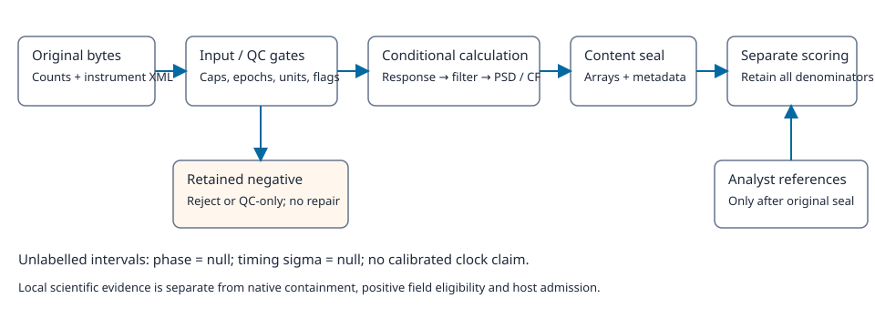

# Local waveform QC, instrument response and unlabelled onset candidates

This chapter documents the implemented ordinary local calculation, **not an online endpoint or an accepted field picker**. It complements the [earthquake phase chapter](phase-picking.md). Two distinct algorithms must not be conflated: the frozen normalized-counts comparator used in the existing STEAD benchmark, and the new instrument-aware `seismic.waveform-qc-classical/v1` calculation. The latter emits unlabelled intervals, never invented P/S classes or calibrated timing uncertainty. Neither a finite trace nor a green unit suite establishes complete method/platform acceptance.

The rejected branch never enters physical inference. The reference branch cannot feed labels back into the calculation. Theme tokens have standalone fallbacks; this repository diagram does not change the UI.

## 1. Observation, rights and physical eligibility

An instrument records integer counts. In frequency space, `Y(f)=H(f)Q(f)+E(f)`: `Q` is the channel-native ground displacement, velocity or acceleration, `H` the entire instrument/electronics response in counts per native SI unit, and `E` noise. Recovering `Q` requires the actual response epoch and every stage's units, gain, poles/zeros or digital coefficients. A channel suffix does not supply these facts, an ADC full-scale range or an absolute clock calibration. Three named channels are not automatically geographic E/N/Z.

The local input is exact MiniSEED2 integer-record bytes, exact StationXML bytes and an explicit native request. Limits precede native decoding:16MiB waveform,2MiB XML (XML1.0, strict UTF-8 or explicitly declared ISO-8859-1),4096 records, at most three unique channels of one station,60000 samples/channel including outside the conditioning slice, and integer rates20/40/50/100/200Hz. Decoded text is charged in UTF-8 bytes; Latin1 is not an expansion loophole. MiniSEED3, archives, compressed wrappers, floating encodings, entity-bearing XML and external retrieval are unsupported. Hashes describe supplied bytes, not provider authenticity. Request identity uses bounded sorted compact ASCII JSON, preserving integer/float and signed-zero distinctions.

Epoch selection joins the nested network/station/location/channel identity and requires a unique epoch covering the whole conditioning window. Missing start dates, overlapping/partial epochs, gaps, overlaps, rate mismatch, blocking quality flags, flat counts or detected/suspected clipping retain a **QC-only** result. Only available counts survive; physical, spectrum, response and candidate products are absent, not simulated zeros. Unsupported encoding/XML instead raises a fixed safe input error and creates no observation result. Unknown/forbidden rights block scientific processing. A caller's rights declaration still does not authenticate redistribution permission.

[STEAD](https://github.com/smousavi05/STEAD) identifies its dataset as [CC BY4.0](https://github.com/smousavi05/STEAD/blob/master/LICENSE); the retained display assets already carry attribution, source changes and byte identities. This chapter publishes only their replay predictions and diagnostics, not another raw copy. The exact SCEDC candidate stays private: cite [SCEDC](https://scedc.caltech.edu/about/citation.html), DOI10.7909/C3WD3xH1, and CI DOI10.7914/SN/CI. The [SCSN public-data terms](https://registry.opendata.aws/southern-california-earthquakes/) are not CC0 or blanket permission for every network. Actual per-object publication review remains required; software licences are not waveform licences.

## 2. Exact conditioning and conditional response removal

Let `x_n` be original integer counts, `f_s` sample rate, `N` conditioning samples, and `τ_n=(n-(N-1)/2)/f_s`. Remove the centred least-squares line `d_n=x_n-mean(x)-bτ_n`, where `b=Στ_n(x_n-mean(x))/Στ_n²`. Original counts are unchanged. Apply the two-ended SAC quarter-cosine time taper with `q=floor(Np/2+0.5)` samples per end and `sin(πn/(2q))` on an edge. `p` is the supplied full two-end fraction, not twice an inferred default.

The FFT length `K` follows the pinned ObsPy `_npts2nfft`, is even, at least2N and no larger than131072. Four ordered positive corners define a zero/half-cosine/one/half-cosine/zero frequency weight `T(f)`. DC and Nyquist are zero. The stabilized inverse is `G(f)=exp(-i arg H(f))/max(|H(f)|, max|H|10^(-v/20))` where response is nonzero. For null water level, every non-DC inverse must be defined and finite, even outside prefilter support; multiplying infinity by zero is not a repair. A response zero within nonzero prefilter support prevents physical processing.

The conditional native estimate is `Q=IRFFT_K(FFT_K(w d) T G)[:N]`. FFT normalization is1/K; there is no additional `dt` or `f_s` factor. The implementation actually calls pinned ObsPy1.4.2 response removal with native DISP/VEL/ACC, without hidden integration/differentiation, and checks the literal complex product. The declared sensitivity must agree with the full response magnitude within the unchanged5% consistency rule at its stated frequency. This is **not** a5% calibration-uncertainty bound.

Independent tests use constant responses, analytic analogue high/low-pass poles/zeros, digital coefficient/FIR transfer products and a full small direct DFT/IDFT. Fixed tolerances are1e-10 relative and1e-12 times the named control scale; scalar SOS/CF controls use1e-9 relative/absolute. Equality-sensitive onset indices remain exact. No tolerance was widened to obtain the receipt.

## 3. Offline filter, edge guard and spectrum

The bandpass is a Butterworth prototype order2..6, realized as normalized second-order sections. The bandpass doubles the transfer order; forward/reverse filtering has steady-state magnitude `|B(f)|²`. It is **acausal**: an impulse can affect earlier samples, so a displayed onset is not an unbiased travel-time measurement. Odd padding is explicit: `P=3(2J+1-min(n_b2zero,n_a2zero))`. Reject a record too short for this padding instead of silently changing the filter.

The valid-mask guard is `g=max(q,ceil(2f_s/f2),L+P,ceil(edge_guard_s f_s))`, where `f2` is the second prefilter corner and `L` the long-window samples. The entire requested analysis must fit inside `[g,N-g)`. The emitted combined-operator tail-energy fraction outside that guard is a diagnostic, **not a universal proof that every waveform transient is harmless**.

All three spectra use the identical valid analysis interval: original counts, response-corrected native motion and filtered native motion. Welch uses periodic Hann `v_j=0.5-0.5cos(2πj/M)`, fixed power-of-two M, half-segment hop, a separately removed mean in every segment, no automatic shortening/zero padding and mean averaging. For `J` complete segments, `U=Σv_j²`, and DFT `Z_jk`,

`PSD_k=γ_k Σ_j |Z_jk|²/(J f_s U)`, withγ=1 at DC/Nyquist and2 elsewhere.

Units are counts²/Hz or the explicitly named native-unit²/Hz. `ΣPSD Δf` equals the averaged window-weighted, segment-detrended energy divided by U, not necessarily full-record variance. The omitted tail, segment count and normalization are reported. Direct DFT and discrete Parseval controls verify these units and factors.

## 4. STA/LTA intervals and separate reference scoring

The actual pinned `classic_sta_lta_py` uses trailing squared-energy means with supplied `S=ceil(sta_s f_s)` and `L=ceil(lta_s f_s)`. It is zero before L-1; internal normalization by maximum absolute filtered signal avoids overflow without changing physical arrays. An all-zero filtered signal legitimately yields no candidates and an explicit warning.

An interval opens only when CF>threshold_on and closes at CF<=threshold_off; the closing sample is excluded. Keep the earliest peak on ties, explicit start/end truncation and a refractory wait ofceil(refractory_s f_s). Candidate indices refer to the conditioning array, with UTC derived from the source clock. Every candidate has `phase=null`, `timing_sigma_s=null`; the clock is never declared independently calibrated.

Seal calculation metadata and all bounded, finite, owned/read-only little-endian array descriptors **before** supplying reference bytes. The seal rejects a wrong native request identity, duplicate/unknown arrays, matching-hash NaN/Infinity, impossible shapes/dtypes, QC physical products and aggregate overflow. A content seal is not a signature or field-authenticity certificate. It prevents accidental changes in the local evaluation seam; a self-authored result is not thereby scientifically valid.

The separate converter admits only its documented bounded STP subset. All rows are checked before channel selection. Analyst quality is ordinal, not Gaussian sigma; unknown uncertainty stays null. Duplicate NSLC+phase rows are ambiguous even at identical times. Evaluation sorts references by UTC/source ID, greedily selects the nearest unused eligible onset within the frozen0.5s tolerance and retains every unknown-channel, ambiguous, out-of-window, QC and unmatched reference. Positive signed residual means late. This is unlabelled onset agreement, not classified-phase F1 or posterior uncertainty.

## 5. Actually executed worked controls and field negatives

The [authored worked artifact](../../data/derived/waveform/m08-authored-worked.json) uses4000 integer samples at100Hz, two amplitude bursts at indices1200..1299 and2000..2099, an explicit1000counts/(m/s) response and the same raw bytes across five runs. These burst boundaries are **not analyst phase labels**. Base processing emits two unlabelled candidates. Doubling the response gain halves motion and quarters native-motion PSD: physical PSD integral changes4.334580482994852→1.083645120748713(m/s)². Changing the band from2..10Hz to6..10Hz changes filtered PSD integral3.9927443334247332→0.014586121674353912(m/s)² on the same analysis interval. Raising threshold_on3.5→5 changes candidate times while preserving physical/filter/spectral products. Increasing guard5→9s changes the mask and necessarily changes the declared analysis interval; its PSD values cannot be presented as a same-window filter comparison. These are controls of real computation, not a calibrated field detector.

The [real display replay](../../data/derived/waveform/m08-heldout-display-replay.json) checks the already selected STEAD held-out display cohort:24 selected,23 valid, one retained QC-rejected noise record. All valid inputs reproduce the frozen counts comparator's onset indices against direct trailing-window sums; maximum CF difference is4.496007975640648e-10 under1e-9 controls. It still has only2/16 provisional P guesses and0/16 provisional S guesses within0.5s, plus seven noise P and six noise S guesses. The first/second trigger labels are an old comparator heuristic, not this new method's output. This display subset was already inspected; it is **not a new untouched cohort**, does not replace the6000-record benchmark, and no M13 inference/training occurred here. Normalized counts without response epochs cannot validate the new physical-response lane.

For the original selected Ridgecrest event38457511, CI.GSC..HNZ, the fixed180s conditioning and120s analysis windows are not moved to match labels. Exact originals match their receipts:32768 waveform bytes (eight records,18001 samples at100Hz; the provider includes an endpoint sample) and9388 XML bytes. The **historical** strict-UTF8 parser rejected the ISO-8859-1 declaration before any engine/decode/response call. That terminal remains immutable. Current A1 admits the unchanged declared transport and resolves the exact bounded response descriptors; this is not an executed original physical correction. Actual original native processing awaits containment. No source bytes are repaired or swapped and no rejected WaveformResult is fabricated.

Only after the original terminal seal was committed did the private catalogue request return7208 bytes. Its ten-token header uses separate event type/domain fields; legacy9 still rejects it. The separately named cloud10 converter admits these unchanged original reference bytes. The only GSC row is HHZ, not HNZ: selected HNZ rows remain empty and scoring must be `not_evaluable`. Do not borrow the HHZ arrival, tune settings or change channels. [Terminal](../design/features/m08-waveform-user-data/evidence/ridgecrest-terminal-20261003.json) and [phase receipts](../design/features/m08-waveform-user-data/evidence/ridgecrest-phase-20261003.json) retain the historical failures without publishing originals.

## 6. Reproduce and apply to other local data

Use an isolated environment with the exact [M08 requirements](../../data-pipeline/requirements-m08.txt); do not alter another method's environment. For already reviewed original bytes, the ordinary callable is `process_waveform_record(raw_mseed, raw_stationxml, request)`. Supply actual byte buffers and every request field explicitly; no path, URL, archive, repair policy or reference labels enter that calculation. It returns actual arrays/metadata or a fixed safe error. Example source/request constructors used in the tests are authored fixtures, never field-data converters.

The [user-data and export guide](waveform-local-data.md) gives the exact ordinary integration interfaces and held CLI contract. Runtime locations, test commands and execution receipts are private operational evidence. Without original opt-in, the two original-only tests explicitly skip; they are not positive field evidence. Tests perform no download. With opt-in, missing files or changed hashes fail, not silently disappear. Never send tracebacks/locals, private paths or samples to public logs. Ordinary callables are not isolation for hostile native inputs.

Exercise: on the authored worked counts, predict the units of motion/PSD after doubling gain, then inspect the actual arrays. Explain why changing a filter can move an acausal trigger and why a perfect content hash cannot establish source clock accuracy. For field data, list the exact response/clock/ADC/rights facts that must be obtained independently of analyst picks before interpreting a residual.

## 7. Remaining full-feature gates

The local response/QC/filter/spectrum/pick/evaluation core, original-format additions and ordinary export writer/read-only reopener are implemented. The fixed Windows observer/controller and CLI admission route are authored; without reviewed private admission, CLI refuses before original/reference reads or output creation. Source tests and declared ctypes layouts do not prove measured SDK ABI, containment or cold native safety. Positive contained scientific CLI, hostile native controls, cancellation/crash/resource measurements, device profiles, original physical case and host admission remain unaccepted until their actual gates run. No fallback profile is activated. Authentication, administration and production backup remain deferred, not removed from the full platform. No UI, learned method, production endpoint or host state changed.

Primary algorithm references: [ObsPy1.4.2 response removal](https://github.com/obspy/obspy/blob/1.4.2/obspy/core/trace.py), [classic STA/LTA](https://github.com/obspy/obspy/blob/1.4.2/obspy/signal/trigger.py), [SciPy1.15.2 sosfiltfilt](https://docs.scipy.org/doc/scipy-1.15.2/reference/generated/scipy.signal.sosfiltfilt.html), [Welch](https://docs.scipy.org/doc/scipy-1.15.2/reference/generated/scipy.signal.welch.html), and [STEAD paper](https://doi.org/10.1109/ACCESS.2019.2947848). Exact source/version retrieval evidence is retained in the waveform feature's research packet; vendor documentation is not evidence that a field or native host gate ran.
