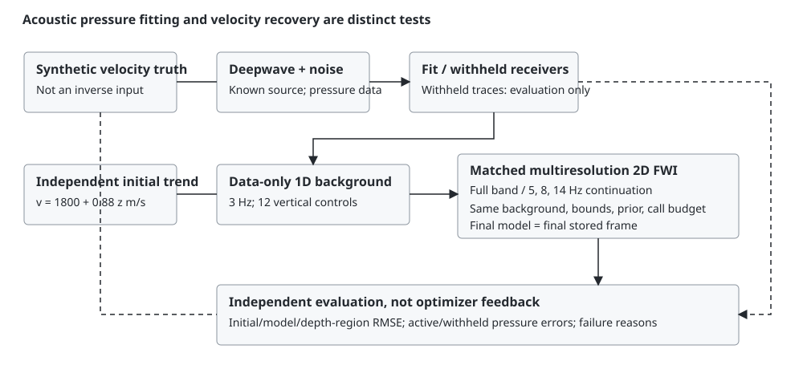

# Acoustic FWI recovery correction

## Scope and scientific boundary

This correction fits constant-density acoustic pressure with genuine Deepwave
finite differences and automatic differentiation. Velocity is in m/s. Synthetic
truth is used to generate observations and, separately, to score the returned
model. It must never enter the inverse initialization, optimizer, parameter
selection or stopping decision. Low waveform error is not a recovery certificate.

The frozen independent starting model is
`v0(x,z) = 1800 + 0.88 z`, with z in metres. The physical domain retains
128 by 96 samples at 12.5 m. Salt is an intentional cycle-skipping challenge.
Failure outputs are retained, not replaced by the known model or hidden.



## Diagnosis and calibration protocol

The prior release reduced waveform error but worsened all 48 full-domain model
errors. Its 20.5 ms moving average transmitted 95.6% of an 8 Hz sinusoid. Its
28 unconstrained-resolution updates favoured shallow fit over deeper background
recovery, and the post-update terminal model was never evaluated.

Before running display cases, the correction is investigated on an independent
calibration section: interfaces `z=210+0.07x` and `z=550+0.055x`, velocities
1720, 2260 and 3070 m/s, plus a 90 m/s smooth lateral perturbation centred at
800 m depth. Seed 67031 controls noise. This geometry is not in the case registry.
Calibration truth may score calibration experiments, but the inverse receives
only observations, survey configuration and the independent trend. Selection of
the final schedule is recorded before evaluating the nominal display cases.

The initial probe tests a bounded coarse 1D background followed by increasingly
fine 2D control grids, a zero-phase FFT Butterworth-amplitude low-pass, and
physical spatial regularization. Record length is increased from 1.1 to 1.6 s to
include deeper reflection arrivals. Every fifth receiver, starting at index 2,
is withheld from all objectives and available only for evaluation. A probe has
a ten-minute budget and stops immediately on nonfinite objectives, allocation
failure or state inconsistencies. Probe evidence is local under
`data/experiments/fwi-*`; canonical artifacts are not changed by probes.

## Primary sources

- [Deepwave FWI example](https://ausargeo.com/deepwave/example_fwi): bounded
  velocities, low-to-high frequency continuation and cycle-skipping limitations.
  Its example is explicitly not a field-validation recipe.
- [Deepwave scalar API](https://ausargeo.com/deepwave/usage): differentiable
  finite-difference propagation, coordinate ordering, PML, fixed maximum
  velocity and gradient-storage sampling. The installed engine is 0.0.27.

## Frozen schedule, before nominal reference evaluation

Two calibration runs preceded display-case evaluation. The first used 25/30/35/35
calls and reduced calibration RMSE from 403.76 to 285.15 m/s in 119.15 s.
The implementation confirmation used 28 calls in every stage, data-only background
shared across methods, and identical priors and spatial parameterizations. It
reduced RMSE to 277.51 m/s (full band) and 278.24 m/s (continuation). Withheld
waveform relative MSE fell from 0.43711 to 0.000256 and 0.001282, respectively.
The pair took 213.14 s, peak allocated CUDA memory 2,092,800,000 bytes.

The schedule is now frozen: initial 1 by 12 control grid at 3 Hz; then 9 by 12,
17 by 24 and 33 by 48 controls. Continuation cutoffs are 5, 8 and 14 Hz; the
matched full-band comparator uses no filtering in its three 2D stages. Both use
beta 0.001, bounded velocities 1400 to 4400 m/s and 28 L-BFGS calls per stage
(strong-Wolfe line search, history 15). The regularization variant changes beta
to 0.03. No display-case target informed these choices.

The nominal evaluation uses this exact schedule without choosing parameters or
selecting iterates by the displayed truth. Both methods are finite-budget solves,
not certified converged optima. More iterations are not silently substituted when
a reference fails. The salt challenge is retained irrespective of its outcome.

## Equations and discretization

The pressure field obeys constant-density acoustics,

\[
v(x,z)^{-2}\partial_t^2p(x,z,t)-\nabla^2p(x,z,t)=s(x,z,t).
\]

The source is a Ricker pulse with known central frequency, amplitude and origin
time. Three sources sit at x = 300, 800, 1275 m and z = 75 m. All receivers
are at z = 75 m; their x coordinates are exported explicitly. Reference geometry
uses 40 receivers, reduced coverage 20. Every fifth receiver with index modulo
five equal to two is excluded from the inverse, leaving 32 or 16 fitted traces
per shot. Withheld receiver data are diagnostic only, never early-stopping data.

The engine uses fourth-order spatial differences, 0.5 ms time sampling, 3200
samples and a 300 m absorbing layer on each boundary. The maximum velocity
passed to the propagator is fixed at 4600 m/s so CFL/PML settings cannot change
as the inverse model changes. The exported grid remains 128 by 96 samples at
12.5 m. Output arrays are transposed to [depth,distance]. Gathers are stored as
[shot,receiver,time] at 4 ms; pressure frames are stored every 24 ms. These are
2D constant-density synthetics, not elastic or variable-density field data.

For control parameters q and bilinear interpolation B onto the propagation grid,

\[
v(q)=1400+3000\,\operatorname{sigmoid}(Bq).
\]

The low-dimensional first stage forces a laterally constant background; subsequent
control meshes admit increasing lateral and vertical spatial detail. The 2D
parameters are not shape templates or truth masks. Interpolation is performed
in bounded-velocity logit coordinates with aligned domain endpoints. Regridding
may change the objective; each stage's initial state is evaluated and recorded.

For active receivers A, forward sampling F, data d, and filter L at cutoff f_c,
the stage objective is

\[
\Phi(q) =
\frac{\operatorname{mean}_{A,s,t}|L_{f_c}(F(v(q))-d)|^2}
     {\operatorname{mean}_{A,s,t}|L_{f_c}d|^2}
+\beta\left[\operatorname{mean}\left(\frac{\Delta_xv}{10\Delta x}\right)^2
+\operatorname{mean}\left(\frac{\Delta_zv}{10\Delta z}\right)^2\right].
\]

The gradient penalty is dimensionless: a 100 m length scale and 1000 m/s velocity
scale give the factor 10 m/s per metre in the denominator. Beta is calibrated,
not selected from display-case truth or called a posterior parameter. This is
energy-normalized least squares; it is not a whitened colored-noise likelihood.
Changing the noise variant changes data noise, not the preselected beta.

The filter amplitude is

\[
H(f;f_c)=[1+(|f|/f_c)^{12}]^{-1/2}.
\]

It is zero-phase, sixth-order Butterworth amplitude filtering in an FFT, not a
moving average or a causal IIR. Traces are zero-padded to the next power of two
at least twice their length and cropped after inverse transform. Zero-extension
edge effects remain and apply equally to observations and predictions. Full-band
stages have H=1. Filtering is differentiable with respect to predicted pressure.

## State identity and comparison

Every optimizer call is followed by a fresh forward evaluation. This includes
the last update. No minimum-raw-loss historical iterate replaces the terminal
regularized state. The final exported model is exactly the last stored frame,
and its predicted/residual arrays and history entry are reevaluated from that
same model. Histories contain stage-entry and accepted optimizer-call states,
not every strong-Wolfe closure trial. They report raw full-band relative MSE;
the separate history records report the actual filtered objective and penalty.

`state_identity.final_frame_index` indexes the final frame;
`selected_iteration` indexes the corresponding history record, not a global
L-BFGS closure count. `frame_indices` and `frame_history_indices` map each frame
to its history record. `predictions` is always `final-model`. The target is
acoustic velocity in m/s, with 2D depth/distance dimensionality and explicit
synthetic provenance.

Both methods reuse the same fitted 1D background, measured observations, masks,
bounds, beta and spatial grids. They each receive 112 optimizer calls including
the 28-call background. The pair costs 196 actual calls because the background
is computed once. Strong-Wolfe closure counts are recorded separately. Equal
call budgets do not mean equal runtimes or equal convergence. The full-band
comparator is not the old unconstrained-resolution Adam implementation.

## Recovery and falsification gates

Whole-model velocity RMSE, starting RMSE, their ratio, signed bias, bounds, and
three depth-region RMSEs are reported separately. Depth bins are z < 300 m,
300 <= z < 600 m, and z >= 600 m. Additional evaluation-only regions separate
cells whose truth differs from the independent starting trend by at least
200 m/s from the remaining background. These masks never enter the inverse.

Active and withheld waveform errors are separate. WRMS divides the RMS residual
by the known Gaussian noise sigma. Relative MSE divides residual energy by
observed energy over the same trace population. They are distinct from model
error; fitting pressure does not identify a unique velocity field.

A nominal case is marked recovered only when whole-model RMSE, active waveform
error and withheld waveform error all improve their independent start.
"Recovered" means that explicit baseline test, not exact geometry. Non-improving
outputs are failed and remain exported. Salt remains an expected negative
control and retains any failed criteria in its reason codes. Finite-budget
optimizer status is independent of scientific recovery status.

The tests include analytical filter attenuation and a finite-difference filter
gradient, spacing-invariant regularization, withheld-data noninterference,
terminal-state identity, real CUDA reference recovery and exact forward replay,
filtered Deepwave adjoint direction checks and stencil-order forward comparison.
An algebraic surrogate is used only for cheap bookkeeping/leakage tests; it is
explicitly not used as evidence of acoustic recovery.

## Reproduction and evidence boundaries

Run the local pipeline environment, with exclusive GPU access:

```powershell
.venv-pipeline/Scripts/python -m pytest tests/test_seismic_recovery.py
```

By default the reference gate performs fresh inversions. For a repeat audit,
`FWI_RECOVERY_PROBES` may point to a local ignored probe directory; every cached
run must match the current solver SHA-256 before reuse, and the tests still
rerun forward predictions on CUDA. Canonical exports are never written by tests.

The simulator preserves the old `simulate(v, frequency, receivers, nt, callback)`
positional API. Its default record remains 2200 samples for existing callers;
`solve_case` explicitly uses 3200. `solve_case(case, variant, iterations=28)` is
also preserved, but iterations now names the per-stage L-BFGS-call budget and
this semantic change is exported. External callers must not mistake 28 for
28 total updates.

Limitations include restricted surface aperture, known source wavelet, 2D
constant-density physics, same-operator canonical synthetics, deterministic noise
realizations and low-dimensional spatial regularization. Independent-stencil
agreement checks numerical dispersion, not geological identifiability or an
independent physics implementation. No field-performance, posterior uncertainty,
convergence or universally superior-method claim follows from these tests.

## Executed reference evidence, 2026-09-24

The frozen schedule was executed once on each of the four reference geometries.
No settings or selected states were changed after seeing their truth scores.
The displayed target and the initial trend are unchanged from the audited release.

| Reference | Initial RMSE (m/s) | Full-band RMSE (m/s) | Continuation RMSE (m/s) | Pair runtime (s) |
|---|---:|---:|---:|---:|
| Layered | 229.095 | 126.806 | 120.575 | 184.47 |
| Normal fault | 301.203 | 211.442 | 212.614 | 179.38 |
| Gas channel | 340.618 | 242.703 | 202.039 | 163.61 |
| Salt challenge | 726.036 | 657.965 | 629.456 | 164.24 |

All six nominal method/reference outputs improve whole-model RMSE and both
active and withheld waveform error. Continuation is not uniformly better:
full-band inversion has marginally lower whole-model RMSE on the normal fault.

| Reference | Initial deep RMSE (m/s) | Full-band deep RMSE | Continuation deep RMSE | Withheld WRMS, full / continuation |
|---|---:|---:|---:|---:|
| Layered | 295.497 | 164.633 | 163.457 | 1.840 / 1.292 |
| Normal fault | 375.051 | 267.502 | 272.527 | 1.438 / 1.666 |
| Gas channel | 366.821 | 193.718 | 167.637 | 3.422 / 2.922 |
| Salt challenge | 702.622 | 774.995 | 781.057 | 2.280 / 2.340 |

Matched-scale velocity/error figures were inspected for all four references.
They show recovered layered interfaces, fault displacement and a low-velocity
channel, but blurred/displaced boundaries and deeper velocity bias remain.
For the channel, the evaluation-only background-region RMSE worsens from
121.24 to 288.93 / 246.36 m/s even as whole-model and deep-region errors improve.
For salt, only the upper body is usefully imaged; deep recovery worsens. The
salt result therefore remains a challenge control, not a recovery-success claim.

The complete reference run took 691.69 s on the NVIDIA RTX 4070 Laptop GPU,
peak allocated memory 2,092,957,696 bytes. CPU threads were set to four in the
probe runner; only one FWI GPU workload ran at a time. Ten tests passed in
12.85 s using solver-digest-matched reference probes, with actual CUDA forward
replay and adjoint execution. The five CPU-only tests independently passed.

A separate forward test analytically sampled a smooth velocity field on
12.5 m / 0.5 ms and 6.25 m / 0.25 ms meshes, with fixed physical acquisition
and absorbing-layer thickness. Point-source amplitude was corrected by cell
area to preserve integrated source strength, not fitted to the other result.
Relative trace-array L2 difference was 0.00268063; individual trace errors were
0.001462 to 0.004699. It took 0.86 s of measured forward/probe time. Both
calculations use Deepwave, so this is independent discretization, not independent
software or field validation.

Local evidence is preserved in `data/experiments/fwi-calibration.json`,
`fwi-summary-reference.json`, `fwi-discretization.json`, the four
`fwi-FWI_*-reference.json` runs, and their matched-scale PNG figures. Solver
SHA-256 for this reference run is
`14d7f447bf2dff9a41d24bcf0b44766f1253c5eeb82b28e30d1ed8269b55d4eb`.
The probe scripts preserve calibration geometry, random seeds and settings.

Only calibration and the four reference conditions were executed in this scoped
correction. The parent integration owns the complete 24-condition canonical
bake and its variant-failure ledger. At measured reference timings the seismic
matrix is approximately 72 to 85 minutes plus serialization and validation;
this is an estimate, not an executed full-matrix result. No canonical artifacts,
frontend files, shared geology or requirements were modified here.

## Candidate-bake handoff and bounded concurrency

The only post-reference solver change normalizes the evaluation label
`expected-negative-control` to `negative-control` for the shared contract.
The normalized solver SHA-256 is
`ed2266ebe1f2574e655f389fe069a7e376cdd9419e9cad8723f1809c926dc6b8`.
Reversing exactly that one string replacement reproduces the original source
digest above. No numerical operation, constant, acquisition or state selection
changed. Four reference probes may therefore be reused with their original
solver/artifact hashes retained and an explicit alias-normalization record.

The 0.04.000 seismic candidate fingerprint is
`f5bd7b0129f5365a27bab794dfb15ccea0b9c87990943638144dae8636ca60c4`.
The parent-owned annotation/export functions attach that fingerprint and
serialize seven significant digits. Candidate output is restricted to the four
seismic child paths in `data/experiments/release-0.04`; this worker never writes
the shared catalogue, release manifest or canonical data. The coordinator's plan,
memory log and completion ledger remain separately under `data/experiments/fwi-*`.

After explicit parent GPU release, the coordinator tests two full-budget
independent worker processes. Each has two CPU threads and a PyTorch caching-
allocator cap of 29% of total visible VRAM. Total memory reported by nvidia-smi,
including other workloads, is polled against 6,000,000,000 bytes. Exceeding the
guard stops only a coordinator-owned worker and reduces concurrency to one;
unrelated processes are never stopped. An allocator cap does not cover every
driver/context allocation, which is why total-device monitoring is separate.
See [PyTorch memory management](https://docs.pytorch.org/docs/2.14/notes/cuda.html#memory-management)
and [per-process allocator limits](https://docs.pytorch.org/docs/2.14/generated/torch.cuda.memory.set_per_process_memory_fraction.html).

Every worker retains 28 L-BFGS calls at all four stages, computes the shared
background only once, and checks the frozen generator fingerprint before and
after inversion. Separate fresh interpreters share no CUDA tensor state;
[PyTorch requires spawn or forkserver for CUDA multiprocessing](https://docs.pytorch.org/docs/2.14/notes/multiprocessing.html#cuda-in-multiprocessing).
Complete outputs are atomically promoted within their own candidate child path.
Resume accepts only matching fingerprints and valid final-frame contracts.

The public, optional two-worker entry point is `data-pipeline/seismic_batch.py`.
The ordinary rebuild command remains sequential. A fresh clone does not require
the original ignored probe files; by default all 24 conditions are planned.

```powershell
.venv-pipeline/Scripts/python data-pipeline/seismic_batch.py prepare --output data/experiments/fwi-candidate
# Only after the GPU is explicitly released by other coordinated work:
.venv-pipeline/Scripts/python data-pipeline/seismic_batch.py run --output data/experiments/fwi-candidate --workers 2 --gpu-released
```

Use `--workers 1` for sequential execution. `--limit 2` bounds a first full-budget
overlap check without reducing any optimizer budget. `--receipts` selects a
separate ignored metadata directory. `--reuse-references` is optional and accepts
only source-digest-matched local probes or the byte-proven label-only migration.
There is no automatic GPU-idle authorization. The coordinator never changes
global GPU settings, never stops an unrelated process and never assembles the
parent's catalogue. On Windows, a guard stop targets only its own live worker
process tree, including any virtual-environment interpreter launcher child.

The executed two-worker overlap check completed layered contrast and noise in
187.72 s wall time (176.40 and 176.55 s of worker compute), with total-device
VRAM peaking at 4,583,325,696 bytes. Both workers reserved 2,118,123,520 bytes;
no memory guard or out-of-memory condition occurred. Both conditions retained
all four 28-call stages. This measured overlap was accepted before starting
the remaining 18 variants; final full-matrix results are recorded separately.
