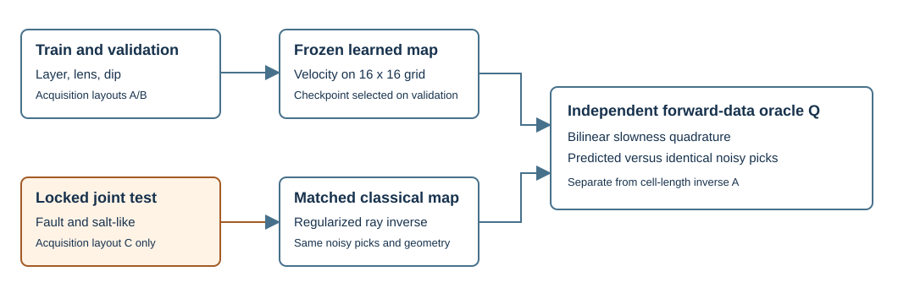

# M12: learned first-arrival velocity validation

## What is measured

M12 currently tests a bounded, 2D, active-source **first-arrival travel-time** inverse on original synthetic velocity maps. Each datum is a noisy arrival time in seconds for a known source-receiver ray; each target cell is velocity in m/s. This is not the wavefield-to-velocity task of [OpenFWI](https://doi.org/10.48550/arXiv.2111.02926), even though both use synthetic structural families to challenge generalization. OpenFWI's [official code](https://github.com/lanl/OpenFWI) supplies waveform InversionNet benchmarks, not a checkpoint or dataset for this method. M09's field traveltime tomography and M10's acoustic full waveform inversion have separate contracts. The older `learning.py` checkpoint predicts a gravity **column-density** map from gravity observations; its 800/160/160 records with seeds 18001/29001/39001 cannot validate seismic velocity. Its existing autoencoder missed 80/80 withheld geometry examples. No part of those results is relabelled M12.



The domain is 800 m horizontally and 800 m deep. A 16 by 16 grid has 50 m cells, with depth positive downward. Three acquisitions provide 128 crossing rays each: 64 left-to-right and 64 top-to-bottom. Layouts A/B are used for training, validation and the in-distribution control; layout C's source and receiver coordinates are absent from A/B. The main locked test also withholds the fault and salt-like model families. The two one-axis tests isolate a new family on A/B and a training family on C.

## Forward law, numerical oracle and limits

The reference trend is `v0(z)=2000+0.35z` m/s. In a fixed straight-ray approximation, travel time is

\[
t_r = \int_{\gamma_r} \frac{1}{v(x,z)}\,\mathrm{d}\ell + \epsilon_r,\qquad
\epsilon_r \sim \mathcal{N}(0,(0.001\;\mathrm{s})^2).
\]

The inverse's ray matrix `A[r,j]` records the exact ray length in cell `j`; its approximate forward prediction is `A(1/v)`. The synthetic data and final consistency check use a separately constructed matrix `Q`: midpoint quadrature integrates bilinearly interpolated cell-centre slowness with at least eight samples per cell width. For a homogeneous 2500 m/s model, both operators agree with geometric distance divided by 2500 to within `1e-10` s. Their heterogeneous predictions differ, so a low inverse-operator residual alone cannot pass the forward-data gate. Both learned and classical maps are reforwarded with `Q` on the **same noisy picks**. The oracle is independent code/discretization, not an independent measured dataset or a bent-ray wave solver. In heterogeneous Earth materials, ray trajectories depend on velocity; the straight-ray assumption and first-arrival pick uncertainty can dominate a millisecond residual. See [Igel et al.](https://doi.org/10.1016/j.pepi.2009.10.002) for the nonlinear ray-path problem and regularized linear approximations.

## Estimators and selection

The neural input is a ray-adjoint backprojection of the travel-time residual from the fixed reference, divided by coverage and converted to a dimensionless 400 m/s scale, plus a normalized ray-coverage channel. Three residual convolution blocks estimate a bounded perturbation; output is `v0+600 tanh(h)`. That output bound is an architectural prior and can exclude an extreme test anomaly. Supervised training uses 800 synthetic realizations, Adam at 0.001, batch size 64, and 40 epochs. The training objective is normalized model MSE plus 0.1 times normalized ray-data MSE. One of 160 validation realizations never appears in training; minimum validation model RMSE chooses the checkpoint. Seeded noise and fixed physical scales are serialized. The network receives neither family names nor true test maps at inference.

The classical comparator uses exactly the same picks, geometry, reference and physical bounds. With `s=1/v`, `q=1000(s-s0)`, `B=A/10`, `y=(t_obs-As0)/0.01`, and first-difference matrix `D`, it solves

\[
\underset{q}{\arg\min}\;\|Bq-y\|_2^2 + \lambda\|Dq\|_2^2 + 0.01\|q\|_2^2.
\]

Its `lambda` is selected once on validation velocity RMSE from {1, 10, 100, 1000}; the frozen choice is 100 in the first full local receipt. The map is then bounded to 1400-4000 m/s. The comparator is deliberately strong for this linearized, densely crossing-ray problem. It is not an acoustic FWI comparator, and its high performance does not prove field identifiability.

## Locked synthetic result, 2026-09-28 CPU run

The first complete local run selected neural epoch 39 of 40. The exact checkpoint SHA-256, split/model/pick hashes, training curve, per-record scores and software versions are in the verified [experimental receipt](../../models/experimental/m12-velocity-cpu-20260928/receipt.json). The original ignored training output remains under `data/experiments/m12-velocity-cpu-20260928-verified/`. This is **not** a canonical public case bake or a field result. Mean values below are means of each realization's spatial or travel-time RMSE, with no dropped cases.

| Cohort | N | Learned map RMSE, m/s | Classical map RMSE, m/s | Learned oracle RMSE, ms | Classical oracle RMSE, ms | Learned forward residuals above threshold |
| --- | ---: | ---: | ---: | ---: | ---: | ---: |
| Validation | 160 | 472.56 | 16.81 | 22.27 | 0.82 | 8 |
| In-distribution control | 160 | 471.31 | 17.08 | 22.41 | 0.84 | 5 |
| New family on A/B | 80 | 533.55 | 94.99 | 28.69 | 2.34 | 25 |
| New acquisition C, known families | 80 | 476.18 | 17.50 | 21.68 | 0.85 | 7 |
| New family and acquisition C | 160 | 536.99 | 95.62 | 28.61 | 2.34 | 43 |

The frozen validation 95th-percentile forward-residual threshold is 34.2220 ms. It flags only 43/160 joint OOD realizations and misses 117/160; on the independent in-distribution control it flags 5/160. This threshold is a synthetic score, not a field-calibrated novelty probability. The CNN loses badly to classical inversion even on the in-distribution control, so the primary failure is learned estimator performance; the increased fault/salt error adds a family-shift failure. The acquisition-only shift changes little relative to the already poor learned baseline. No held-out M12 advantage, full seismic inversion, external field generalization, geological truth recovery or calibrated uncertainty is claimed. The negative comparison is retained rather than tuning on the locked test.

## Reproduction, interpretation and exercise

Create an ignored local Python environment with NumPy 2.2.6, SciPy 1.15.2 and Torch 2.14.0. On Windows, from the repository root run:

```powershell
./scripts/run_m12_velocity.ps1 -Device cpu -Output data/experiments/m12-velocity-new
./scripts/run_m12_velocity.ps1 -Verify -Output data/experiments/m12-velocity-new
$env:M12_VELOCITY_RECEIPT = 'data/experiments/m12-velocity-new'
.\.venv-m12\Scripts\python.exe -m pytest -o addopts= tests/learning/test_velocity_inversion.py tests/learning/test_split_and_benchmark.py
```

The verification command reloads the checkpoint, checks its hash and source hash, regenerates the locked cohorts, and recomputes both estimators' metrics. It also accepts `-Output models/experimental/m12-velocity-cpu-20260928` to verify the retained experimental pair. Use a **new** output path when training: the command refuses to overwrite an earlier receipt. `-Fixture` produces a small mechanical check explicitly labelled fixture-only; it is ineligible as scientific evidence. CUDA must be scheduled away from the M13 training worktree; the current receipt proves CPU training only.

Interpretation exercise: using the receipt's per-family and per-acquisition tables, compare fault versus salt failures, then compare those with acquisition-only C. Calculate the joint OOD flag sensitivity `43/160` and identify the 117 missed cases. Explain why the classical inverse's 2.34 ms oracle residual on joint OOD does not validate bent-ray field physics. A correct answer distinguishes a numerical forward check from independent field observations and does not infer a unique subsurface velocity from this synthetic grid.

## Gate status

The local named gates check partition disjointness, homogeneous travel-time units, independent heterogeneous operator behavior, checkpoint hash/reload, exact same-input comparator, metric recomputation and retained negative verdict. The scientific acceptance gate for learned held-out advantage **fails**. GPU training, waveform inversion transfer, field acquisition, field truth, calibration, web artifact bake, and release publication are outside this receipt and remain open. The feature's [requirements](../design/features/m12-velocity-validation/requirements.md) and [design](../design/features/m12-velocity-validation/design.md) define the frozen protocol.
